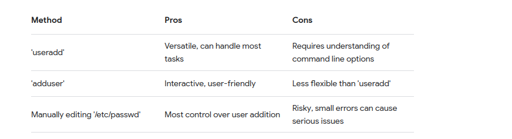

# LINUX Questions


## 1. What’s Difference Between Grep, Egrep and Fgrep in Linux?

In Linux, `grep`, `egrep`, and `fgrep` are all command-line utilities used for searching plain-text data sets for lines that match a regular expression. They have some differences in terms of their functionality and usage. Here’s a detailed comparison:

### 1. `grep`

- **Function**: Searches for patterns using basic regular expressions (BRE).

- **Usage**: `grep [options] pattern [file...]`

- Features

  :

  - Supports a limited set of regular expression syntax.
  - Can be combined with various options to enhance search (e.g., `-i` for case-insensitive search, `-v` to invert the match).
  - Example: `grep 'pattern' file.txt`

### 2. `egrep` (Extended grep)

- **Function**: Searches for patterns using extended regular expressions (ERE).

- **Usage**: `egrep [options] pattern [file...]`

- Features

  :

  - Supports a more powerful set of regular expression syntax compared to `grep`.
  - For instance, it supports `+`, `?`, `|`, and `()` without needing to escape them.
  - Example: `egrep 'pattern|another' file.txt`

- **Note**: As of GNU `grep` 2.5.3, `egrep` is deprecated and equivalent to `grep -E`.

### 3. `fgrep` (Fixed grep)

- **Function**: Searches for patterns that are fixed strings (literally) and does not interpret regular expressions.

- **Usage**: `fgrep [options] string [file...]`

- Features

  :

  - Faster for searching fixed string patterns as it does not process regular expressions.
  - Useful for searching multiple patterns from a file (using `-f` option).
  - Example: `fgrep 'exact string' file.txt`

- **Note**: As of GNU `grep` 2.5.3, `fgrep` is deprecated and equivalent to `grep -F`.

### Summary of Main Differences:

- **Regular Expression Support**:
  - `grep`: Basic regular expressions.
  - `egrep`: Extended regular expressions.
  - `fgrep`: Fixed strings (no regular expressions).
- **Command Equivalents** (due to deprecation):
  - `egrep` is equivalent to `grep -E`.
  - `fgrep` is equivalent to `grep -F`.

### Example Comparison:

- **Basic `grep`**:

```
grep 'hello' file.txt
```

**Extended `egrep`**:

```
sh
egrep 'hello|world' file.txt
# or using `grep -E`
grep -E 'hello|world' file.txt
```

**Fixed `fgrep`**:

- ```
  fgrep 'hello world' file.txt
  # or using `grep -F`
  grep -F 'hello world' file.txt
  ```

### Conclusion:

While `grep`, `egrep`, and `fgrep` provide similar functionality, the choice between them depends on the type of pattern matching required. However, with `egrep` and `fgrep` being deprecated in favor of `grep -E` and `grep -F`, it's recommended to use the `grep` command with appropriate options for future compatibility and standardization.


# 2. How many new directories will be created after running the following command
mkdir {a..c}{1..3}
The command `mkdir {a..c}{1..3}` uses brace expansion to create multiple directories in a single command. Let's break down the brace expansion:

- `{a..c}` expands to `a`, `b`, and `c`.
- `{1..3}` expands to `1`, `2`, and `3`.

When combined, each letter from `{a..c}` is paired with each number from `{1..3}`. This creates the following combinations:

- `a1`, `a2`, `a3`
- `b1`, `b2`, `b3`
- `c1`, `c2`, `c3`

In total, there are 33 letters and 33 numbers, leading to 3×3=93×3=9 combinations.

Therefore, the command `mkdir {a..c}{1..3}` will create **9 new directories**. Here is the list of the directories that will be created:

- `a1`
- `a2`
- `a3`
- `b1`
- `b2`
- `b3`
- `c1`
- `c2`
- `c3`


# 3. Your PC is configured with a DNS server address but not the default gateway. Can the PC access internet?

No, the PC cannot access the internet if it is configured with a DNS server address but not the default gateway. Here's why:

1. **DNS Server Role**: The DNS (Domain Name System) server translates human-readable domain names (like [www.example.com](http://www.example.com)) into IP addresses that computers use to communicate with each other. This allows your PC to resolve domain names to IP addresses.
2. **Default Gateway Role**: The default gateway is a network device (typically a router) that routes traffic from your local network to other networks, including the internet. Without a default gateway, your PC does not know where to send packets that are destined for outside your local network.

### Explanation:

- **Local Network Communication**: Your PC can communicate with other devices on the same local network (LAN) directly, because it can reach them without needing a default gateway.
- **Internet Communication**: To access resources on the internet, your PC needs to send packets to devices outside your local network. These packets must be sent to the default gateway, which then forwards them to the appropriate destination on the internet. Without a default gateway, your PC has no route to reach external networks.

### DNS Lookups:

- Even if your PC can perform DNS lookups and resolve domain names to IP addresses, it still won't be able to communicate with those IP addresses on the internet without a default gateway.

### Summary:

- **Can perform DNS lookups**: Yes, but only within the local network or if the DNS server is reachable without needing a gateway.
- **Can access the internet**: No, because it lacks a default gateway to route the traffic outside the local network.

In conclusion, both DNS server configuration and default gateway settings are essential for full internet access.


# 4. What is the difference between IP and Gateway?

### IP Address

1. **Definition**:
   - An IP (Internet Protocol) address is a unique identifier assigned to each device on a network. It allows devices to locate and communicate with each other.
2. **Types**:
   - **IPv4**: A 32-bit number typically written in decimal format as four octets separated by periods (e.g., 192.168.1.1).
   - **IPv6**: A 128-bit number written in hexadecimal format separated by colons (e.g., 2001:0db8:85a3:0000:0000:8a2e:0370:7334).
3. **Purpose**:
   - Identifies individual devices on a network.
   - Used for routing data packets to and from the device.

### Gateway

1. **Definition**:
   - A gateway is a network node that acts as an access point to another network, often serving as a route for traffic from a local network to other networks, such as the internet.
2. **Functionality**:
   - The default gateway is typically a router that connects a local network (LAN) to the internet.
   - It routes packets from the local network to destinations outside that network, such as remote servers on the internet.
3. **Purpose**:
   - Provides an entry and exit point for data traffic entering and leaving the local network.
   - Facilitates communication between the local network and external networks.

### Key Differences

1. **Role**:
   - **IP Address**: Identifies individual devices on a network.
   - **Gateway**: Acts as a bridge between different networks, facilitating communication and routing traffic.
2. **Function**:
   - **IP Address**: Used by devices to identify each other and route data within the same network.
   - **Gateway**: Routes data between the local network and external networks, ensuring proper delivery of packets outside the local network.
3. **Usage in Networking**:
   - **IP Address**: Every device (e.g., computers, smartphones, printers) on a network has its own IP address.
   - **Gateway**: Typically, there is one default gateway per network segment that devices use to communicate with devices outside their local network.

### Example Scenario

- **IP Address**:
  - Device A on a home network has the IP address 192.168.1.2.
  - Device B on the same network has the IP address 192.168.1.3.
  - They can communicate directly using these IP addresses.
- **Gateway**:
  - The home network uses a router with the IP address 192.168.1.1 as the default gateway.
  - When Device A wants to send a request to a website on the internet, it sends the data to the default gateway (the router).
  - The router then forwards the request to the appropriate destination on the internet.

In summary, an IP address is crucial for identifying and communicating with individual devices on a network, while a gateway is essential for routing traffic between different networks, particularly for accessing external networks like the internet.


# 5. Can you assign one static IP to 2 computers, if not then why?

No, you cannot assign the same static IP address to two computers on the same network. Here are the reasons why this is not possible and the consequences of attempting to do so:

### Reasons

1. **Unique Identifier**: An IP address serves as a unique identifier for a device on a network. This uniqueness ensures that data packets can be correctly routed to the intended recipient.
2. **Address Resolution Protocol (ARP) Conflicts**: ARP is used to map IP addresses to MAC (Media Access Control) addresses on a local network. If two devices have the same IP address, ARP will have conflicting entries, leading to unpredictable routing of packets.
3. **Network Confusion**: When two devices share the same IP address, network devices like switches and routers cannot distinguish between them. This leads to confusion in routing tables, causing network disruptions.

### Consequences

1. **IP Address Conflicts**: Network devices (e.g., routers) will detect an IP address conflict and may disable one or both devices from the network to prevent further issues.
2. **Loss of Connectivity**: Both devices with the duplicate IP address will experience intermittent connectivity or complete network disconnection, as the network cannot reliably route packets to the correct device.
3. **Unpredictable Behavior**: Network communications will be unreliable. Data intended for one device might be sent to the other or get lost entirely, leading to unpredictable behavior and degraded network performance.

### Example Scenario

- **Device A** has the IP address 192.168.1.10.
- **Device B** is incorrectly assigned the same IP address 192.168.1.10.

When Device A sends out an ARP request for 192.168.1.1 (the default gateway), the router caches the MAC address of Device A. When Device B later tries to communicate, the router is confused because the ARP table now has two devices with the same IP address but different MAC addresses. This results in:

- Packets intended for Device A might end up at Device B and vice versa.
- Both devices might intermittently lose network connectivity as the ARP table updates with the conflicting information.

### Proper Configuration

To avoid these issues, each device on a network must have a unique IP address. Here are some best practices:

1. **Static IP Addresses**: Manually assign unique static IP addresses to each device, ensuring no overlap.
2. **DHCP**: Use a DHCP (Dynamic Host Configuration Protocol) server to automatically assign unique IP addresses from a defined range to each device on the network.

By following these practices, you ensure that each device can communicate reliably and efficiently on the network without IP address conflicts. 

# 6. How to change IPs address to static?

https://www.freecodecamp.org/news/setting-a-static-ip-in-ubuntu-linux-ip-address-tutorial/

# 7. Explain the difference between relative and absolute path ?

### Relative Path:

- **Definition**: A relative path specifies the location of a file or directory relative to the current working directory.
- **Usage**: It is used when referring to a file or directory in relation to the current location in the file system.
- **Example**: Consider the following directory structure:

- ```
  /home/user/Documents/
  └── projects
      ├── project1
      └── project2
  ```

  - If the current working directory is `/home/user/Documents/projects`, and you want to access a file named `file.txt` located in `project1`, you can specify the relative path as `project1/file.txt`.

### Absolute Path:

- **Definition**: An absolute path specifies the precise location of a file or directory from the root of the file system.
- **Usage**: It is used when referring to a file or directory without regard to the current working directory.
- **Example**: Using the same directory structure as above:
  - The absolute path to `file.txt` located in `project1` is `/home/user/Documents/projects/project1/file.txt`.
  - The absolute path always starts from the root directory (`/`), traversing through each directory until reaching the target file or directory.

### Differences:

1. **Reference Point**:
   - **Relative Path**: Relative to the current working directory.
   - **Absolute Path**: Starts from the root of the file system.
2. **Portability**:
   - **Relative Path**: May vary depending on the current working directory.
   - **Absolute Path**: Always points to the same location regardless of the current working directory.
3. **Length**:
   - **Relative Path**: Typically shorter and more concise.
   - **Absolute Path**: Can be longer, especially for deeply nested files or directories.
4. **Readability**:
   - **Relative Path**: Can be easier to read and understand, especially within a local context.
   - **Absolute Path**: Provides an explicit and complete reference to the file or directory location.

### When to Use Each:

- **Relative Path**: Use when referring to files or directories within the same project or directory structure, or when the location of the file is relative to the current working directory.
- **Absolute Path**: Use when referring to files or directories in a consistent and unambiguous manner, or when the location of the file is known regardless of the current working directory.

Understanding the differences between relative and absolute paths is crucial for navigating the file system efficiently and accurately specifying file or directory locations in Linux.

# 8. How to Add user in linux



1. **useradd Command**:
   - The `useradd` command is a common method to add users in Linux. It adds a new user account to the system.
   - Syntax:

```
sudo useradd username
```

Example:

- ```
  sudo useradd john
  ```

- Additional options can be used with `useradd` to specify various parameters such as home directory, user ID (UID), group, shell, etc.

**adduser Command**:

- The `adduser` command is a higher-level interface to `useradd`, which provides a more user-friendly interactive way to add users with default settings.
- Syntax:

```
sudo adduser username
```

Example:

- ```
  sudo adduser mary
  ```

- `adduser` prompts for additional information such as password, user's full name, etc., making it easier to use for beginners.

**usermod Command**:

- The `usermod` command is used to modify existing user accounts in Linux. While it's not typically used solely for adding users, it can be used to add additional groups, change home directory, or set other user properties after creation.
- Syntax (for adding a user to a group):

```
sudo usermod -aG groupname username
```

Example:

```
sudo usermod -aG sudo john
```

This command adds the user `john` to the `sudo` group, granting administrative privileges.


https://www.geeksforgeeks.org/useradd-command-in-linux-with-examples/

# 9. What is the command to change file/directory ownership and group ?

The command to change file or directory ownership and group in Linux is `chown`. This command allows you to change the owner and/or group of a file or directory. Here's the syntax:

```
sudo chown [OPTIONS] owner[:group] file/directory
```

- `OPTIONS`: Optional flags that modify the behavior of the `chown` command.
- `owner`: The new owner of the file or directory.
- `group`: The new group of the file or directory (optional).
- `file/directory`: The file or directory whose ownership and/or group you want to change.

### Examples:

1. **Change Ownership Only**:

```
sudo chown newowner file.txt
```

This command changes the owner of `file.txt` to `newowner` while leaving the group unchanged.

**Change Ownership and Group**:

```
sudo chown newowner:newgroup file.txt
```

This command changes both the owner and group of `file.txt` to `newowner` and `newgroup` respectively.

**Change Group Only**:

```
sudo chown :newgroup file.txt
```

This command changes only the group of `file.txt` to `newgroup` while leaving the owner unchanged.

**Change Ownership Recursively for Directory**:

1. ```
   sudo chown -R newowner:newgroup directory/
   ```

   The `-R` option recursively changes the ownership and group of all files and subdirectories within `directory`.

### Notes:

- To use `chown`, you typically need superuser privileges (`sudo`), as changing ownership of files is a sensitive operation that can affect system security.
- If you omit the group, only the owner is changed. If you omit both owner and group, nothing happens.
- Ownership changes can only be performed by the superuser or by the owner of the file.
- Group changes can only be performed by the superuser or by a user who is a member of the desired group.

By using the `chown` command with appropriate options and arguments, you can effectively manage file and directory ownership and group in Linux. 


The `chgrp` command in Linux is used to change the group ownership of files or directories. It allows you to modify the group ownership without changing the owner or any other file attributes. Here's the syntax:

```
sudo chgrp [OPTIONS] group file/directory
```

- `OPTIONS`: Optional flags that modify the behavior of the `chgrp` command.
- `group`: The new group to assign ownership to.
- `file/directory`: The file or directory whose group ownership you want to change.

### Examples:

1. **Change Group Ownership of a File**:

```
sudo chgrp newgroup file.txt
```

This command changes the group ownership of `file.txt` to `newgroup`.

**Change Group Ownership of a Directory**:

```
sudo chgrp newgroup directory/
```

This command changes the group ownership of `directory/` to `newgroup`.

**Change Group Ownership Recursively**:

1. ```
   sudo chgrp -R newgroup directory/
   ```

   The `-R` option recursively changes the group ownership of all files and subdirectories within `directory/`.

### Notes:

- Similar to `chown`, the `chgrp` command typically requires superuser privileges (`sudo`) to change the group ownership of files.
- Only the owner of a file or a superuser can change its group ownership.
- The `chgrp` command does not affect the ownership of symbolic links but changes the group ownership of the linked file.

The `chgrp` command provides a straightforward way to change the group ownership of files and directories in Linux, allowing for efficient management of file permissions and access control.


# 10. list the linux file system ?

1. **ext4 (Fourth Extended File System)**:
   - ext4 is the default file system for many Linux distributions.
   - It is an improved version of the ext3 file system with better performance, scalability, and reliability.
   - Supports large file sizes and volumes.
   - Provides features like journaling, extended attributes, and file system encryption.
2. **ext3 (Third Extended File System)**:
   - ext3 is the predecessor of ext4 and is still widely used.
   - It includes features such as journaling for improved data integrity and recovery after system crashes.
   - Provides compatibility with ext2, allowing ext2 volumes to be upgraded to ext3 without reformatting.
3. **ext2 (Second Extended File System)**:
   - ext2 was the standard file system for Linux before the introduction of ext3 and ext4.
   - It lacks journaling support, which makes it less robust than ext3 and ext4 in case of unexpected system shutdowns.
   - Still used in some scenarios where journaling is not required or for compatibility reasons.
4. **Btrfs (B-tree File System)**:
   - Btrfs is a modern copy-on-write (COW) file system designed for Linux.
   - It offers features such as snapshots, checksums, and built-in RAID support, making it suitable for both single devices and multi-device setups.
   - Supports online volume growth and shrinking, as well as transparent compression and deduplication.
5. **XFS (XFS File System)**:
   - XFS is a high-performance journaling file system developed by SGI.
   - It is known for its scalability and suitability for large files and volumes.
   - Supports features like metadata journaling, extended attributes, and online resizing.
6. **NTFS (New Technology File System)**:
   - NTFS is a proprietary file system developed by Microsoft.
   - While not native to Linux, Linux distributions often include support for reading and writing to NTFS volumes.
   - Widely used for Windows operating systems and compatible with Linux through third-party drivers.
7. **FAT32 (File Allocation Table)**:
   - FAT32 is an older file system originally developed for MS-DOS.
   - It has limited support for file and volume sizes compared to modern file systems.
   - Despite its limitations, FAT32 remains popular for USB flash drives and other removable media due to its broad compatibility with various operating systems.
8. **exFAT (Extended File Allocation Table)**:
   - exFAT is a proprietary file system developed by Microsoft.
   - It is designed for use with flash drives and other removable media, offering support for large file sizes and volumes compared to FAT32.
   - Like NTFS, exFAT is not native to Linux but can be accessed through third-party drivers.

# 11. When you login you get a message on the screen. What is the name of that file and where is it located?

The message displayed on the screen when a user logs in is typically stored in a file called `motd` (message of the day).

### Location of the `motd` file:

In most Linux distributions, the `motd` file is located in the `/etc` directory. However, the specific location may vary depending on the distribution and its configuration. Here are common locations:

- **Ubuntu/Debian**:
  - `/etc/motd`
  - `/etc/update-motd.d/`

### Customization:

You can customize the message of the day by editing the `motd` file or by adding scripts to the `/etc/update-motd.d/` directory. The scripts in the `update-motd.d` directory are executed at login, allowing you to dynamically generate the message based on system information or other factors.

Keep in mind that modifications to the `motd` file or scripts in the `update-motd.d` directory may require superuser privileges (`sudo`). Always make backups before making changes to system files.

# 12. What is /bin directory used for  ?

The `/bin` directory in Linux is used to store essential binary executables (commands) that are required for the system to boot, operate, and perform basic system tasks. Here's what the `/bin` directory is used for:

1. **Storing Essential System Binaries**:
   - The `/bin`  directory contains essential system binaries that are required for basic system functionality, such as:
     - Common shell commands like `ls`, `cp`, `mv`, `rm`, `cat`, `grep`, `chmod`, `chown`, etc.
     - System administration utilities like `su`, `sudo`, `passwd`, `shutdown`, `reboot`, etc.
     - Essential system daemons and services.
2. **Providing Command-Line Interface (CLI) Tools**:
   - Most of the commands and utilities available in the `/bin` directory are intended to be used from the command line interface (CLI) to perform various tasks such as file management, process management, user management, and system administration.
3. **Accessible to All Users**:
   - The binaries in the `/bin` directory are typically accessible to all users of the system. They are stored in a location that is included in the system's default executable search path (`$PATH`), allowing users to execute these commands without specifying their full path.
4. **System Boot and Recovery**:
   - During system boot, the `/bin` directory is one of the first directories accessed by the system. Essential system binaries located in `/bin` are used during the boot process to initialize the system, start system services, and bring the system to a usable state.
   - In cases where the system encounters issues and needs to be recovered or repaired, tools and utilities stored in the `/bin` directory are often used for troubleshooting and maintenance tasks.
5. **Separation of Essential Binaries**:
   - The `/bin` directory is part of the Filesystem Hierarchy Standard (FHS) for Unix-like operating systems. It is separate from other directories like `/usr/bin` (which contains user binaries) to ensure that essential system binaries are available even if other filesystems are not mounted.

Overall, the `/bin` directory plays a crucial role in the functioning of a Linux system by providing access to essential system binaries and utilities required for basic system operation and administration.

# 13. What are the different types of DNS Server ?

1. **Authoritative DNS Server**:
   - An authoritative DNS server is responsible for providing authoritative answers to DNS queries for the domains it is authoritative for.
   - It holds the authoritative DNS records (such as A, AAAA, CNAME, MX, NS, etc.) for the domain names it serves.
   - Authoritative DNS servers are configured by domain administrators and are typically operated by domain registrars, web hosting providers, or organizations managing their own DNS infrastructure.
2. **Recursive DNS Server**:
   - A recursive DNS server, also known as a resolver, is responsible for resolving DNS queries on behalf of clients.
   - When a client sends a DNS query to a recursive DNS server, the server recursively resolves the query by querying other DNS servers until it finds the authoritative answer.
   - Recursive DNS servers cache DNS records to improve performance and reduce the load on upstream DNS servers.
   - Internet service providers (ISPs), public DNS services like Google DNS and OpenDNS, and enterprise DNS servers often operate recursive DNS servers.
3. **Caching DNS Server**:
   - A caching DNS server is a type of recursive DNS server that focuses primarily on caching DNS records to reduce query response times.
   - It caches DNS records obtained from authoritative DNS servers in response to client queries and serves subsequent queries from its cache whenever possible.
   - Caching DNS servers are commonly used in large networks, ISPs, and organizations to improve DNS resolution performance and reduce DNS query latency.
4. **Forwarding DNS Server**:
   - A forwarding DNS server is a type of recursive DNS server that forwards DNS queries to another DNS server for resolution.
   - Instead of performing recursive resolution itself, a forwarding DNS server forwards queries to another DNS server (such as an ISP's DNS server or a public DNS resolver) and returns the response to the client.
   - Forwarding DNS servers are often used in scenarios where DNS resolution needs to be offloaded to another server, such as in corporate networks or when using a DNS-based content filtering service.
5. **Root DNS Server**:
   - Root DNS servers are the authoritative servers at the root of the DNS hierarchy.
   - They respond to DNS queries for the top-level domains (TLDs) by providing referrals to the authoritative DNS servers for the appropriate TLDs.
   - The root DNS server infrastructure is managed by several organizations in different geographical regions to ensure redundancy and reliability of the DNS root system.
6. **Secondary (Slave) DNS Server**:
   - A secondary DNS server is a backup server that replicates DNS zone data from a primary (master) DNS server.
   - It serves DNS queries for the zones it hosts and can also act as an authoritative DNS server if the primary server is unavailable.
   - Secondary DNS servers provide redundancy and fault tolerance by ensuring that DNS zone data is available from multiple sources.


# 14 . How to change a user password?

1. Open a terminal window.
2. Type the following command and press Enter:

```
passwd username
```

Replace `username` with the name of the user whose password you want to change.

You will be prompted to enter the new password for the user. Type the new password and press Enter.

You will then be asked to re-enter the new password for confirmation. Type the new password again and press Enter.


# 15. Linux Distribution

### General-Purpose Distributions:

1. **Ubuntu**
2. **Debian**
3. **Fedora**
4. **CentOS**
5. **Arch Linux**
6. **openSUSE**
7. **Linux Mint**
8. **Manjaro**
9. **Gentoo**
10. **Slackware**

### Security and Penetration Testing:

1. **Kali Linux**
2. **Parrot Security OS**
3. **BackBox**
4. **BlackArch Linux**

### Lightweight Distributions:

1. **Puppy Linux**
2. **Lubuntu**
3. **Xubuntu**
4. **Tiny Core Linux**
5. **Bodhi Linux**

### Education and Learning:

1. **Edubuntu**
2. **Fedora Education Spin**
3. **Ubuntu Studio**

### Privacy and Anonymity:

1. **Tails**
2. **Whonix**

### Gaming:

1. **SteamOS**
2. **Ubuntu GamePack**

### Multimedia and Content Creation:

1. **Ubuntu Studio**
2. **AV Linux**
3. **KXStudio**

### Specialized and Niche Distributions:

1. **Rocky Linux**
2. **Alpine Linux**
3. **NixOS**
4. **Void Linux**
5. **Endless OS**

### Community and Custom Distributions:

1. **ArchBang**
2. **antiX**
3. **PureOS**
4. **Garuda Linux**
5. **Feren OS**

# 16 . How to logoff from the system?

o log off from a Linux system, you can use various methods depending on the desktop environment or the terminal interface you are using. Here are some common methods:

### Graphical User Interface (GUI):

1. **Using the Logout Option**:
   - If you are using a graphical desktop environment like GNOME, KDE Plasma, or Xfce, you can typically log off by following these steps:
     - Click on the user or profile icon in the system menu located in the top-right or bottom-right corner of the screen.
     - Select the "Log Out" or "Sign Out" option from the menu.
     - Confirm the log out action if prompted.
2. **Keyboard Shortcut**:
   - Some desktop environments may provide a keyboard shortcut to log out. For example, in GNOME, you can usually press `Ctrl + Alt + Delete` to bring up the logout dialog.

### Terminal Interface (Command Line):

1. **Using the `exit` Command**:
   - If you are logged in through a terminal interface (such as a virtual console or an SSH session), you can simply type the `exit` command and press Enter. This will log you out of the current session and return you to the login prompt.
2. **Using the `logout` Command**:
   - Some systems may have a `logout` command available in the terminal, which performs a similar action to `exit`. You can type `logout` and press Enter to log out.
3. **Closing the Terminal Window**:
   - If you are using a terminal emulator (such as GNOME Terminal, Konsole, or Terminator), you can log out by simply closing the terminal window.

# 17. What is the purpose of having different network ports ?

The purpose of having different network ports is to enable multiple network services and applications to run concurrently on a single device (such as a computer or server) without interfering with each other. Each network service or application typically communicates through a specific port number, allowing network traffic to be directed to the appropriate destination.

Here are some key reasons for using different network ports:

1. **Service Differentiation**: Different network ports allow network services and applications to be uniquely identified and differentiated from each other. For example, port 80 is commonly used for HTTP web traffic, while port 443 is used for HTTPS encrypted web traffic.
2. **Concurrency**: By using different ports, multiple network services and applications can operate simultaneously on the same device. This enables multitasking and efficient resource utilization, as each service can listen for incoming connections on its designated port without conflicting with others.
3. **Security**: Network ports can be used as a security mechanism to control access to specific services and applications. Firewall rules and access control lists (ACLs) can be configured to allow or block traffic based on port numbers, helping to protect against unauthorized access and network attacks.
4. **Protocol Support**: Different network protocols often use specific port numbers to standardize communication. For example, port 25 is used for SMTP email communication, port 22 is used for SSH secure shell access, and port 53 is used for DNS domain name resolution.
5. **Load Balancing**: In distributed systems and server clusters, network ports can be used for load balancing and traffic distribution. Load balancers can direct incoming requests to multiple backend servers based on port numbers, helping to distribute workload and improve performance.
6. **Customization and Flexibility**: Having a range of available port numbers allows developers and administrators to customize network configurations and allocate ports based on specific requirements and preferences. This flexibility enables fine-grained control over network traffic and service deployment.

# 18. How to display first column of a file ?

To display the first column of a file in Linux, you can use the `awk` command. Here's how to do it:

```
awk '{print $1}' filename
```

Replace `filename` with the name of the file you want to extract the first column from.

Explanation:

- `awk` is a versatile text processing tool that allows you to manipulate and extract data from text files.
- `{print $1}` is an `awk` command that tells `awk` to print the first field (column) of each line.
- `$1` represents the first field (column) of the input line.

For example, if you have a file named `data.txt` with the following content:

```
Name Age City
John 25 New York
Alice 30 Los Angeles
```

Running the command `awk '{print $1}' data.txt` will output:

```
Name
John
Alice
```

This command extracts and displays the first column (Name) from each line of the file.

# 19.  What is the difference between nslookup and dig commands?

Both `nslookup` and `dig` are command-line utilities used for DNS (Domain Name System) troubleshooting and querying DNS servers. While they serve similar purposes, there are some differences between the two:

1. **Features and Functionality**:
   - **`nslookup`**: `nslookup` is an older utility that has been widely used for DNS troubleshooting. It provides basic DNS lookup functionality, allowing users to query DNS records, perform reverse DNS lookups, and display information about DNS servers.
   - **`dig`**: `dig` (Domain Information Groper) is a more modern and feature-rich utility compared to `nslookup`. It provides more detailed information about DNS queries, including additional record types, DNSSEC (DNS Security Extensions) support, and better control over query options.
2. **Output Format**:
   - **`nslookup`**: The output of `nslookup` is more compact and may not provide as much detailed information compared to `dig`.
   - **`dig`**: `dig` provides more verbose output, including additional information such as query statistics, response headers, and message flags. This can be helpful for debugging and troubleshooting DNS issues.
3. **Supported Record Types**:
   - **`nslookup`**: `nslookup` supports basic DNS record types such as A, AAAA, MX, NS, PTR, and SOA records. However, it may not support newer record types or DNSSEC-related queries.
   - **`dig`**: `dig` supports a wide range of DNS record types, including all standard record types as well as DNSSEC-related records like DNSKEY, RRSIG, and DS records. This makes it more versatile for querying different types of DNS information.
4. **Syntax and Usage**:
   - **`nslookup`**: The syntax and usage of `nslookup` may vary slightly between different operating systems and versions. It typically uses interactive mode by default, allowing users to enter queries interactively.
   - **`dig`**: `dig` follows a more standardized syntax and usage pattern across different platforms. It is often used in non-interactive mode, where queries are specified as command-line arguments.

In summary, while both `nslookup` and `dig` are useful tools for DNS troubleshooting and querying, `dig` offers more advanced features, better control over query options, and support for a wider range of DNS record types. As a result, `dig` is often preferred for more detailed and comprehensive DNS queries and analysis.


# 20. How to check your user id and group id ?

To check your user ID (UID) and group ID (GID) in a Unix-like operating system such as Linux, you can use the `id` command. Here's how:

```
id
```

Running this command without any options will display information about your current user, including the UID, GID, and supplementary group memberships.

If you want to specifically check your UID and GID separately, you can use the `-u` option to display only the UID and the `-g` option to display only the GID:

```
id -u  # Display user ID (UID)
id -g  # Display group ID (GID)
```

Alternatively, if you want to check the UID and GID of a different user, you can specify the username as an argument to the `id` command:

```
id username
```

Replace `username` with the username of the user whose UID and GID you want to check.

For example, if you run `id` without any options, you might see output similar to this:

```
uid=1000(your_username) gid=1000(your_groupname) groups=1000(your_groupname),4(adm),24(cdrom),27(sudo),30(dip),46(plugdev),116(lpadmin),126(sambashare)
```

In this output, `uid` represents the user ID (UID), `gid` represents the primary group ID (GID), and `groups` lists additional groups that the user is a member of.

# 21 . What is the difference between “kill” and “kill -9” command?

The `kill` and `kill -9` commands are both used to terminate processes in Unix-like operating systems, such as Linux. However, there is a significant difference between them:

1. **`kill` Command**:
   - The `kill` command sends a signal to a process, asking it to terminate gracefully. By default, `kill` sends the `SIGTERM` signal (signal number 15) to the target process.
   - When a process receives the `SIGTERM` signal, it is given the opportunity to perform cleanup tasks and exit gracefully. For example, it may close open files, release allocated resources, and save its state before terminating.
2. **`kill -9` Command**:
   - The `kill -9` command sends the `SIGKILL` signal (signal number 9) to a process, forcing it to terminate immediately and unconditionally.
   - Unlike `SIGTERM`, which allows the process to handle the termination signal and perform cleanup tasks, `SIGKILL` does not give the process any chance to clean up. Instead, it immediately terminates the process, which can result in data loss or other undesirable effects if the process was in the middle of performing critical operations.

In summary:

- Use `kill` to gracefully terminate a process, giving it a chance to clean up and exit properly.
- Use `kill -9` as a last resort to forcefully terminate a process if it is unresponsive or cannot be terminated using the `kill` command. However, be aware that using `kill -9` can potentially lead to unexpected behavior or data loss, so it should be used judiciously.

# 22. Subnet

A subnet (short for "subnetwork") is a logical subdivision of an IP network. It is created by dividing a larger network into smaller, more manageable segments to improve network performance, security, and organization. Subnetting is a fundamental concept in IP networking, allowing efficient use of IP addresses and facilitating routing and communication between devices within a network.

Key characteristics of subnets include:

1. **IP Address Range**:
   - Each subnet is assigned a range of IP addresses from the parent network's address space. These addresses are used to identify devices within the subnet.
2. **Subnet Mask**:
   - A subnet mask is used to distinguish the network portion of an IP address from the host portion. It defines the boundary between the network and host parts of the address. Subnet masks consist of a series of binary bits, where each bit set to 1 represents the network portion, and each bit set to 0 represents the host portion.
3. **Subnet ID**:
   - The subnet ID is the network address of the subnet, obtained by applying the subnet mask to the IP address. It identifies the specific subnet within the larger network.
4. **Broadcast Address**:
   - The broadcast address is a special address used to send data to all devices within the subnet. It is the highest address in the subnet's address range, with all host bits set to 1.
5. **Host Range**:
   - The host range consists of all addresses within the subnet's address range, excluding the network address and the broadcast address. These addresses are assigned to individual devices within the subnet.

Subnetting allows network administrators to:

- Efficiently allocate IP addresses by dividing a large address space into smaller, more manageable chunks.
- Improve network performance by reducing broadcast traffic and optimizing routing.
- Enhance network security by logically separating different departments, functions, or security zones within an organization.
- Facilitate scalability and flexibility in network design and management.

Overall, subnets play a crucial role in organizing and optimizing IP networks, enabling efficient communication and resource utilization in modern computer networks.

# 23. rsyslogd

`rsyslogd` is a system logging daemon used in Unix-like operating systems, including Linux. It is responsible for receiving, processing, and forwarding log messages generated by various system components, services, and applications.

### Purpose of `rsyslogd`:

1. **Centralized Logging**:
   - `rsyslogd` facilitates centralized logging by collecting log messages from multiple sources across the system and optionally forwarding them to a central logging server. This centralized approach simplifies log management, analysis, and troubleshooting in distributed environments.
2. **Flexible Configuration**:
   - `rsyslogd` offers extensive configuration options, allowing administrators to customize log handling according to their specific requirements. Configuration files can specify which log messages to collect, where to store them, how to format them, and whether to forward them to remote servers.
3. **Log Message Processing**:
   - `rsyslogd` supports powerful filtering capabilities to selectively process log messages based on various criteria such as severity level, facility, source IP address, or message content. This enables administrators to prioritize critical messages, discard irrelevant ones, or take specific actions based on predefined rules.
4. **Reliability and Performance**:
   - `rsyslogd` is designed for high reliability and performance, capable of handling a large volume of log messages efficiently while minimizing system resource usage. It employs multithreading and asynchronous I/O operations to process incoming messages quickly and reliably.
5. **Security and Integrity**:
   - `rsyslogd` provides features for ensuring the security and integrity of log messages, such as encryption of log data during transmission over the network (e.g., using TLS), authentication mechanisms for verifying the identity of log sources, and access controls for restricting access to sensitive log information.
6. **Integration with Other Tools**:
   - `rsyslogd` integrates seamlessly with other system monitoring and management tools, such as log analyzers, monitoring solutions (e.g., Nagios, Zabbix), and security information and event management (SIEM) systems. This interoperability enhances the overall visibility and control of the system environment.

Overall, `rsyslogd` plays a critical role in system administration, monitoring, and troubleshooting by centralizing and managing log data effectively. It helps administrators maintain system reliability, security, and performance by providing insights into system events, errors, and activities.

# 24. Which permission allows a user to run an executable with the permissions of the owner of that file?

The permission that allows a user to run an executable file with the permissions of the owner of that file is the "setuid" permission, represented by the "s" in the owner's execute permission slot.

When the setuid permission is set on an executable file, the user who executes the file temporarily gains the privileges of the file's owner while the program is running. This means that the program runs with the permissions and privileges of the owner, rather than the permissions and privileges of the user who executed the program.

To set the setuid permission on an executable file, you can use the `chmod` command with the numerical mode or symbolic mode. Here's an example of using the symbolic mode to set the setuid permission:

```
chmod u+s filename
```

Replace `filename` with the name of the executable file for which you want to set the setuid permission.

It's important to note that the setuid permission can pose security risks if not used carefully, as it can potentially allow users to escalate their privileges and perform unauthorized actions. Therefore, setuid should only be set on executable files where it is explicitly required and appropriate, and careful consideration should be given to the security implications.

# 25. un compress (untar) file in linux

The term "untar" is a colloquial term used to describe the process of extracting files from a tar archive. It's essentially the opposite operation of creating a tar archive, often referred to as "tarball".

To untar a tarred file, you use the `tar` command in Unix-like operating systems. Here's the basic syntax:

```
tar -xvf filename.tar
```

Explanation of options used:

- `-x`: This option tells `tar` to extract files from the archive.
- `-v`: This option enables verbose mode, which displays detailed output during the extraction process. It's optional but helpful for seeing the list of files being extracted.
- `-f`: This option specifies the name of the tarred file to extract from.

Replace `filename.tar` with the name of the tarred file you want to extract.

If the tarred file is compressed with gzip (`.tar.gz` extension), you can use the following command to both decompress and extract the files:

```
tar -xzvf filename.tar.gz
```

Explanation of the additional option:

- `-z`: This option tells `tar` to decompress the file using gzip before extracting its contents.

Similarly, if the tarred file is compressed with bzip2 (`.tar.bz2` extension), you can use the following command:

```
tar -xjvf filename.tar.bz2
```

Explanation of the additional option:

- `-j`: This option tells `tar` to decompress the file using bzip2 before extracting its contents.

Using these commands, you can easily perform the "untar" operation to extract the contents of tarred files on Linux and Unix-like operating systems.

# 26 . What is /proc directory used for ?

The `/proc` directory in Unix-like operating systems, such as Linux, is a special virtual filesystem that provides an interface to kernel data structures and system information. It does not contain real files on disk but instead dynamically generates virtual files and directories based on the current state of the running system.

Here are some key uses and features of the `/proc` directory:

1. **Process Information**: The `/proc` directory contains a subdirectory for each running process on the system, identified by its process ID (PID). Each process directory contains information about the process, such as its status, memory usage, open file descriptors, command-line arguments, environment variables, and more. This information can be accessed and read by users and system utilities for monitoring and debugging purposes.
2. **System Information**: The `/proc` directory includes various files and directories that provide information about the system's hardware, kernel configuration, and runtime parameters. For example:
   - `/proc/cpuinfo`: Contains information about the CPU(s) installed on the system.
   - `/proc/meminfo`: Provides details about system memory usage, including total memory, free memory, and usage by different memory types.
   - `/proc/version`: Displays information about the kernel version and compilation options.
   - `/proc/sys`: Contains virtual files and directories for configuring kernel parameters and system settings. Users and administrators can read or write to these files to modify kernel behavior at runtime.
3. **Device Information**: The `/proc` directory exposes information about devices and device drivers in the system. For example:
   - `/proc/devices`: Lists the character and block devices registered with the kernel.
   - `/proc/interrupts`: Shows interrupt usage statistics for each CPU and device in the system.
   - `/proc/ioports`: Displays information about I/O port ranges used by device drivers.
4. **Network Information**: The `/proc` directory includes files and directories related to network interfaces, connections, and statistics. For example:
   - `/proc/net`: Contains information about network protocols, connections, interfaces, and statistics.
   - `/proc/sys/net`: Provides virtual files for configuring network-related kernel parameters.
5. **Kernel Information**: The `/proc` directory exposes internal kernel data structures and runtime information, allowing users and system utilities to query and inspect kernel state. This can be useful for diagnosing kernel issues, monitoring system performance, and optimizing kernel parameters.

# 27. nsswitch.conf  file

The `nsswitch.conf` file, which stands for "Name Service Switch configuration," is a configuration file used in Unix-like operating systems, including Linux. Its primary purpose is to specify the order and sources of various name services used for resolving user and system identifiers, such as usernames, group names, hostnames, and other network-related information.

Here's an overview of the purpose and functionality of the `nsswitch.conf` file:

1. **Name Service Switch (NSS)**:
   - The Name Service Switch is a modular system in Unix-like operating systems that allows different name services to be used for resolving various types of system and network identifiers. These name services include local files, DNS (Domain Name System), NIS (Network Information Service), LDAP (Lightweight Directory Access Protocol), and others.
2. **Configuration File**:
   - The `nsswitch.conf` file is used to configure the behavior of the Name Service Switch by specifying the order and sources of name services to be used for different types of lookups.
   - It consists of multiple lines, each specifying a particular database (e.g., `passwd`, `group`, `hosts`) and the corresponding sources or methods to use for resolving entries in that database.
3. **Database Types**:
   - The nsswitch.conf file typically includes directives for configuring various types of databases, such as:
     - `passwd`: User account information (e.g., usernames, passwords, user IDs).
     - `group`: Group information (e.g., group names, group IDs, group memberships).
     - `hosts`: Hostname resolution (e.g., mapping hostnames to IP addresses).
     - `networks`: Network address resolution (e.g., mapping network names to network addresses).
     - `services`: Service name resolution (e.g., mapping service names to port numbers).
     - `protocols`: Protocol name resolution (e.g., mapping protocol names to protocol numbers).
4. **Lookup Order**:
   - For each database type, the `nsswitch.conf` file specifies the order in which different sources or methods should be queried to resolve entries. For example, it determines whether to look up user account information in local files (`/etc/passwd`, `/etc/shadow`) or in a centralized directory service like LDAP.
5. **Flexibility and Customization**:
   - The `nsswitch.conf` file allows administrators to customize the behavior of the Name Service Switch according to their specific requirements and environment. By modifying the configuration, administrators can control where system and network identifiers are resolved from and prioritize different sources.

Overall, the `nsswitch.conf` file plays a crucial role in configuring name resolution and identity management in Unix-like operating systems. It provides a flexible and centralized mechanism for specifying the order and sources of name services used for resolving system and network identifiers, ensuring efficient and reliable operation of the system.

# 28. Fire wall

A firewall is a network security device or software application that monitors and controls incoming and outgoing network traffic based on predetermined security rules. Its primary purpose is to establish a barrier between a trusted internal network (such as a company's private network) and untrusted external networks (such as the internet) to protect against unauthorized access, cyberattacks, and other security threats.

Here are the key purposes and functions of a firewall:

1. **Access Control**: Firewalls enforce access control policies by inspecting network packets and determining whether to allow or block them based on predefined rules. These rules can specify criteria such as source and destination IP addresses, ports, protocols, and application-layer information.
2. **Security Policy Enforcement**: Firewalls enforce security policies defined by organizations to protect their networks and assets. These policies may include rules for allowing or denying specific types of traffic, blocking malicious IP addresses, and restricting access to sensitive resources.
3. **Traffic Filtering**: Firewalls filter network traffic to prevent unauthorized access and malicious activities. They can block known threats, such as malware, viruses, worms, and denial-of-service (DoS) attacks, by inspecting packets and comparing them against threat signatures or behavioral patterns.
4. **Network Address Translation (NAT)**: Firewalls often include NAT functionality to translate private IP addresses used on an internal network into a single public IP address for outbound communication with external networks. This helps conserve public IP addresses and enhances network security by hiding internal IP addresses from external hosts.
5. **Packet Inspection and Logging**: Firewalls inspect network packets at the packet, state, and application layers to detect suspicious or anomalous behavior. They may log information about network traffic, such as source and destination addresses, ports, protocols, and packet contents, for auditing, analysis, and forensic purposes.
6. **Virtual Private Network (VPN) Support**: Many firewalls support VPN functionality to establish secure encrypted tunnels for remote users or branch offices to connect to the corporate network over untrusted networks, such as the internet. VPNs ensure confidentiality, integrity, and authenticity of transmitted data.
7. **Intrusion Detection and Prevention**: Some advanced firewalls integrate intrusion detection and prevention capabilities to identify and block known and emerging threats in real time. They use techniques such as signature-based detection, anomaly detection, and behavior analysis to detect and mitigate attacks.

# 29. What is the difference between memory, virtual memory and cache 

### Memory (RAM)

- **Definition**: Memory refers to physical RAM (Random Access Memory) installed in a computer.

- **Purpose**: RAM is used to store data and machine code currently being used by the operating system and applications. It is fast, temporary storage that provides quick access to the CPU.

- Characteristics

  :

  - Volatile: Contents are lost when the system is powered off.
  - Limited in size: The amount of physical RAM is finite and depends on the hardware configuration.
  - High speed: RAM is much faster than storage devices like hard drives or SSDs.

### Virtual Memory

- **Definition**: Virtual memory is a memory management capability that provides an "idealized abstraction of the storage resources that are actually available on a given machine". It combines physical RAM with a portion of the disk storage to provide a larger apparent memory space.

- **Purpose**: Allows the system to run larger applications and more processes than would be possible with only physical RAM. It helps in efficiently using the available physical memory and isolating process memory spaces.

- Components

  :

  - **Swap Space**: A designated area on a storage device (like a hard drive or SSD) that the operating system uses to extend RAM. When physical memory is full, inactive pages of memory can be moved to the swap space.
  - **Paging**: The process of moving pages of data between physical RAM and swap space.

- Characteristics

  :

  - Virtual: Provides an abstraction that creates the illusion of a very large main memory.
  - Can lead to slower performance if excessive swapping (thrashing) occurs due to over-reliance on swap space.

### Cache

- **Definition**: Cache is a smaller, faster type of volatile memory that provides high-speed data access to frequently accessed data and instructions.

- **Purpose**: Caches are used to speed up data access by storing copies of frequently accessed data from slower memory or storage systems.

- Types

  :

  - **CPU Cache**: Small, ultra-fast memory located on or very close to the CPU. It stores copies of frequently accessed memory locations to reduce latency and increase speed.
  - **Disk Cache**: Uses a portion of RAM to store frequently accessed data from a storage device to speed up read/write operations.
  - **Page Cache**: Part of the virtual memory system used to cache pages of data read from or written to storage, reducing disk I/O operations.

- Characteristics

  :

  - Hierarchical: Different levels (L1, L2, L3) with varying sizes and speeds, closer caches are faster but smaller.
  - Non-persistent: Like RAM, cache memory is volatile and does not retain information when the system is powered off.

### Summary

- **Memory (RAM)**: Physical, volatile memory used by the system and applications for fast data access.
- **Virtual Memory**: A system that extends RAM with disk space to provide a larger addressable memory space, using concepts like paging and swap space.
- **Cache**: High-speed memory used to temporarily store frequently accessed data and instructions to improve overall system performance. Includes CPU cache, disk cache, and page cache.

# 30 . what is mail command

The `mail` command is a basic command-line email client for sending and receiving email.

#### Sending Email

To send an email using the `mail` command:

```
echo "This is the body of the email" | mail -s "Subject of the email" recipient@example.com
```

Or interactively:

```
mail -s "Subject of the email" recipient@example.com
# Then type the body of the email. End with CTRL+D.
```

#### Reading Email

To read emails:

```
mail
```

# 31. Sort the text file Content

To sort a file in reverse order in Linux, you can use the `sort` command with the `-r` option. The `sort` command sorts lines of text files, and the `-r` option tells it to sort in reverse order.

Here's the basic syntax for sorting a file in reverse order:

```
cat filename | sort -r
```

OR

```
sort -r filename
```

Replace `filename` with the name of the file you want to sort.

### Example

Suppose you have a file named `example.txt` with the following content:

```
plaintext
apple
orange
banana
grape
kiwi
```

To sort this file in reverse order, you would use the following command:

```
sort -r example.txt
```

The output would be:

```
plaintext
orange
kiwi
grape
banana
apple
```

### Saving the Output to a New File

If you want to save the sorted output to a new file, you can redirect the output using the `>` operator:

```
sort -r example.txt > sorted_example.txt
```

This command will create a new file called `sorted_example.txt` with the sorted content.

### In-Place Sorting (GNU `sort` with `-o` Option)

If you want to sort the file in place (overwrite the original file with the sorted content), you can use the `-o` option provided by GNU `sort`:

```
sort -r -o filename filename
```

For example:

```
sort -r -o example.txt example.txt
```

This command sorts `example.txt` in reverse order and saves the sorted content back to `example.txt`.

### Summary

- **Basic reverse sort**: `sort -r filename`
- **Save to a new file**: `sort -r filename > newfile`
- **Sort in place**: `sort -r -o filename filename`

# 32. Unix Vs Unix like OS

The term "Unix" refers to a family of multitasking, multiuser computer operating systems that derive from the original AT&T Unix. There are several operating systems that run Unix or are Unix-like, often sharing many characteristics and design principles of the original Unix system. Here are some of the most well-known ones:

### True Unix Systems

These operating systems are directly certified as conforming to the Single UNIX Specification:

1. **AIX**: Developed by IBM, AIX (Advanced Interactive eXecutive) is a series of proprietary Unix operating systems.
2. **HP-UX**: Hewlett-Packard's proprietary Unix operating system.
3. **Solaris**: Originally developed by Sun Microsystems, now maintained by Oracle Corporation.
4. **Tru64 UNIX**: Originally developed by Digital Equipment Corporation, later acquired by Compaq and then HP.

### Unix-like Operating Systems

These systems are not certified Unix but are Unix-like, meaning they follow many Unix principles and may provide similar interfaces and functionalities:

1. **Linux**: A Unix-like operating system kernel that, along with various distributions like Ubuntu, Fedora, Debian, and Red Hat, provides a complete operating system environment. While not certified as Unix, Linux is widely used and very similar in design and functionality.
2. **BSD**: The Berkeley Software Distribution, a Unix derivative developed and distributed by the University of California, Berkeley. Popular BSD variants include:
   - **FreeBSD**
   - **OpenBSD**
   - **NetBSD**
3. **macOS**: Developed by Apple Inc., macOS (formerly known as OS X) is a Unix-certified operating system based on the Darwin core, which includes components derived from NeXTSTEP, BSD Unix, and other technologies.

### Summary

- **True Unix Systems**: AIX, HP-UX, Solaris, Tru64 UNIX.
- **Unix-like Systems**: Linux (e.g., Ubuntu, Fedora), BSD variants (e.g., FreeBSD, OpenBSD, NetBSD), macOS.


# 33. List all byte sizes from smallest to largest?

1. **Bit** (b) - The smallest unit of data in computing, representing a single binary value (0 or 1).
2. **Nibble** - 4 bits or half a byte.
3. **Byte** (B) - 8 bits.
4. **Kilobyte** (KB) - 1,024 bytes (2^10 bytes).
5. **Megabyte** (MB) - 1,024 kilobytes (2^10 KB), or 1,048,576 bytes (2^20 bytes).
6. **Gigabyte** (GB) - 1,024 megabytes (2^10 MB), or 1,073,741,824 bytes (2^30 bytes).
7. **Terabyte** (TB) - 1,024 gigabytes (2^10 GB), or 1,099,511,627,776 bytes (2^40 bytes).
8. **Petabyte** (PB) - 1,024 terabytes (2^10 TB), or 1,125,899,906,842,624 bytes (2^50 bytes).
9. **Exabyte** (EB) - 1,024 petabytes (2^10 PB), or 1,152,921,504,606,846,976 bytes (2^60 bytes).
10. **Zettabyte** (ZB) - 1,024 exabytes (2^10 EB), or 1,180,591,620,717,411,303,424 bytes (2^70 bytes).
11. **Yottabyte** (YB) - 1,024 zettabytes (2^10 ZB), or 1,208,925,819,614,629,174,706,176 bytes (2^80 bytes).

### Less Common Byte Sizes

- **Kibibyte** (KiB) - 1,024 bytes, used in some contexts as a binary prefix to avoid confusion with the kilobyte which is sometimes considered as 1,000 bytes in decimal notation.
- **Mebibyte** (MiB) - 1,024 KiB.
- **Gibibyte** (GiB) - 1,024 MiB.
- **Tebibyte** (TiB) - 1,024 GiB.
- **Pebibyte** (PiB) - 1,024 TiB.
- **Exbibyte** (EiB) - 1,024 PiB.
- **Zebibyte** (ZiB) - 1,024 EiB.
- **Yobibyte** (YiB) - 1,024 ZiB.

### Summary

- **Smallest to Largest**: Bit, Nibble, Byte, Kilobyte, Megabyte, Gigabyte, Terabyte, Petabyte, Exabyte, Zettabyte, Yottabyte.
- **Binary Prefix Equivalents**: Kibibyte, Mebibyte, Gibibyte, Tebibyte, Pebibyte, Exbibyte, Zebibyte, Yobibyte.

# 34. i node

An inode, short for "index node," is a data structure used by Unix-like operating systems to store metadata about a file or directory. Each file or directory on a Unix filesystem is associated with an inode, which contains information such as the file's permissions, ownership, timestamps, and pointers to the data blocks on the disk where the file's contents are stored.

### Common Metadata Stored in an Inode:

- **File type and permissions**: Whether the inode represents a regular file, directory, symbolic link, etc., and the permissions associated with it.
- **Ownership**: The user and group owners of the file.
- **File size**: The size of the file in bytes.
- **Timestamps**: The creation, modification, and access times of the file.
- **Pointers to data blocks**: Pointers to the disk blocks where the file's data is stored.

### How to Find the Inode of a File:

1. **Using `ls` Command with `-i` Option**: You can use the `-i` option with the `ls` command to display the inode number of a file or directory.

```
ls -i filename
```

**Using `stat` Command**: The `stat` command displays detailed information about a file, including its inode number.

```
stat filename
```

**Using `find` Command**: The `find` command with the `-inum` option can be used to find files by their inode number.

1. ```
   find /path/to/search -inum inode_number
   ```

### Example:

Suppose we have a file named `example.txt`. To find its inode number, we can use the `ls -i` command:

```
ls -i example.txt
```

This command will display the inode number along with the filename.

### Summary:

- An inode is a data structure used by Unix-like operating systems to store metadata about a file or directory.
- Inodes contain information such as file type, permissions, ownership, timestamps, and pointers to data blocks.
- In Unix-like systems, you can find the inode of a file using commands like `ls -i`, `stat`, or `find`.

# 35. uniq and sed commands

### `uniq` Command:

**Purpose**: `uniq` is used to filter adjacent duplicate lines from a sorted file or input stream.

**Functionality**: It reads the input, compares adjacent lines, and removes duplicates, producing a unique set of lines in the output.

**Usage**:

```
uniq [options] [input_file [output_file]]
```

**Options**:

- `-c`: Prefix lines with the count of occurrences.
- `-d`: Only show duplicate lines.
- `-i`: Ignore differences in case when comparing lines.

**Examples**:

1. **Remove Duplicate Lines from a File**:

```
cat file.txt
mathematica
Apple
Banana
Apple
Orange
Banana
Apple


uniq file.txt
mathematica
Apple
Banana
Orange
```

**Count Occurrences of Each Unique Line**:

```
uniq -c file.txt
```

```
  3 Apple
  1 Banana
  1 Apple
  1 Orange
  1 Banana
  1 Apple
```

### `sed` Command:

**Purpose**: `sed` (stream editor) is used for filtering and transforming text.

**Functionality**: It reads input line by line, applies specified commands or operations to each line, and outputs the modified text.

**Usage**:

```
sed [options] [script] [input_file]
```

**Options**:

- `-n`: Suppress automatic printing of pattern space.
- `-e script`: Add the script to the commands to be executed.

**Examples**:

1. **Search and Replace Text in a File**

```
sed 's/old_text/new_text/g' file.txt
```

**Delete Lines Matching a Pattern**:

```
sed '/pattern/d' file.txt
```

**Extract Specific Lines Based on a Pattern**:

```
sed -n '/pattern/p' file.txt
```

- **`s`**: This command stands for "substitute." It's used to search for a pattern and replace it with another pattern. For example, `s/old_text/new_text/g` replaces all occurrences of `old_text` with `new_text` in each line of the input.
- **`d`**: This command stands for "delete." It's used to delete lines matching a specified pattern. For example, `/pattern/d` deletes all lines containing the specified pattern.
- **`g`**: This flag stands for "global." It's used in conjunction with the `s` command to perform a global substitution, meaning to replace all occurrences of the pattern in each line, not just the first occurrence.
- **`-n`**: This option stands for "quiet" or "silent." It suppresses automatic printing of pattern space only. When used with the `p` command, it selectively prints lines matching a pattern.

# 36. Archiving and Compression

1. **tar**:
   - **Purpose**: `tar` is used for creating and extracting tar archives, which are collections of files and directories bundled together into a single file.
   - **Functionality**: It doesn't compress the files; it just archives them together. Tar archives are often used for distributing or backing up multiple files while preserving their directory structure.
   - **Command**: `tar` command is used for creating (`-c`), extracting (`-x`), listing (`-t`), and appending (`-r`) tar archives.
2. **gzip**:
   - **Purpose**: `gzip` is used for file compression. It reduces the size of files by compressing them using the DEFLATE algorithm.
   - **Functionality**: It compresses single files into a `.gz` compressed file, replacing the original file.
   - **Command**: The `gzip` command is used for compressing files. After compression, the original file is replaced by a compressed file with a `.gz` extension.
3. **gunzip**:
   - **Purpose**: `gunzip` is used to decompress files compressed with `gzip`.
   - **Functionality**: It decompresses `.gz` files back into their original form.
   - **Command**: The `gunzip` command is used for decompressing `.gz` files. It replaces the compressed file with the original uncompressed file.

Other related commands include:

- **bzip2** and **bunzip2**: Similar to `gzip` and `gunzip`, but they use the Burrows-Wheeler Transform algorithm for compression.
- **xz** and **unxz**: Use the LZMA compression algorithm, offering better compression ratios than `gzip` and `bzip2`.
- **zip** and **unzip**: Commonly used on Windows systems, `zip` creates and extracts ZIP archives.

### Summary:

- **tar**: Creates and extracts tar archives without compression.
- **gzip**: Compresses single files using the DEFLATE algorithm.
- **gunzip**: Decompresses files compressed with `gzip`.


# 37. Linux Processes 

#### 1. Introduction to Processes:

A process represents a running instance of a program within the system. Each process is uniquely identified by a Process ID (PID) and may have parent-child relationships, where child processes are spawned by parent processes.

#### 2. Types of Processes:

a) **Interactive Processes**:

- These processes are initiated by users through terminals or graphical interfaces.
- Examples include commands executed in a terminal or graphical applications like web browsers.
- Interactive processes require user input and provide real-time output.

b) **Background Processes**:

- Background processes operate independently of user interaction.
- They often perform system tasks or run as system daemons.
- Examples include cron jobs, system monitoring utilities, and automated backup tasks.

c) **Kernel Processes**:

- Kernel processes are integral components of the Linux kernel.
- They handle low-level system operations such as memory management, device I/O, and process scheduling.
- Kernel processes run in kernel mode and have privileged access to system resources.

d) **Zombie Processes**:

- Zombie processes are terminated processes that still have entries in the process table.
- They occur when a parent process fails to collect the exit status of its terminated child.
- Zombie processes consume minimal system resources but should be cleaned up to avoid resource wastage.

e) **Orphan Processes**:

- Orphan processes are created when parent processes terminate before their children.

- These processes are adopted by the init process (PID 1) and continue execution under its supervision.

- Init becomes the new parent, ensuring orphan processes can continue execution.

  

  - **Zombie processes** have completed execution but are waiting for their exit status to be read by their parent process. They appear in the process table but do not consume resources other than the entry itself.
  - **Orphan processes** are still running processes whose parent has terminated. They are adopted by the `init` process and continue to run normally until they complete.

  ### 

#### 3. Process States:

a) **Running State**:

- A process is actively executing instructions and utilizing CPU resources.
- It performs tasks assigned to it by the system or user.

b) **Sleeping State**:

- A process is waiting for a specific event or condition to occur.
- It temporarily suspends its execution until the event triggers.

c) **Stopped State**:

- A process is halted or paused, usually by receiving a signal from the system or user.
- It can be resumed or terminated based on user or system intervention.

d) **Zombie State**:

- A terminated process that has completed execution but still has an entry in the process table.
- Zombie processes await the collection of their exit status by their parent processes.

#### 4. Process Management:

- Process Monitoring
  - Utilities like `ps`, `top`, and `htop` provide insights into running processes and their resource usage.
  
- Process Termination
  - The `kill` command is used to terminate processes by sending specific signals.
  
- Process Prioritization
  - The `nice` command allows adjustment of process priority to manage resource allocation effectively.
  
    

### Threads

A **thread** is the smallest unit of execution within a process. Threads within the same process share the same memory space and resources, which makes communication between threads easier and faster but requires careful synchronization to avoid conflicts.

Key characteristics of threads:

- **TID (Thread ID):** Each thread has a unique identifier, though it shares the PID of its parent process.
- **Shared Memory:** Threads share the same address space within a process, which includes code, data, and resources.
- **Lightweight:** Creating and managing threads is generally more efficient than processes because of the shared context.
- **Synchronization:** Threads need mechanisms like mutexes, semaphores, and condition variables to coordinate access to shared resources.

### Differences Between Processes and Threads

1. **Memory Sharing:**
   - Processes: Do not share memory; each has its own address space.
   - Threads: Share memory within the same process.
2. **Creation Overhead:**
   - Processes: Higher overhead due to the need to duplicate the entire address space.
   - Threads: Lower overhead as they share the process’s address space.
3. **Communication:**
   - Processes: Use IPC mechanisms such as pipes, message queues, or shared memory.
   - Threads: Directly share data within the process’s address space.
4. **Isolation and Security:**
   - Processes: High isolation, which enhances security and stability.
   - Threads: Less isolation, increasing the risk of data corruption due to shared memory.

 # 38. Regular expression

A regular expression (regex or regexp) is a sequence of characters that define a search pattern. Typically, these patterns are used by string-searching algorithms for "find" or "find and replace" operations on strings, or for input validation. Regular expressions are a powerful tool for matching, searching, and manipulating text based on specific patterns.

### Key Components of Regular Expressions

1. **Literals**:
   - Characters that match themselves.
   - Example: `a` matches the character "a".
2. **Meta Characters**:
   - Special characters with a specific meaning.
   - Examples include `.`, `^`, `$`, `*`, `+`, `?`, `|`, `{}`, `[]`, `()`, `\`.

### Meta Characters and Their Uses

1. **`.` (Dot)**:
   - Matches any single character except a newline.
   - Example: `a.b` matches "acb", "a1b", "a-b", but not "ab" or "a\nb".
2. **`^` (Caret)**:
   - Matches the start of a line.
   - Example: `^abc` matches "abc" only if it is at the beginning of a line.
3. **`$` (Dollar)**:
   - Matches the end of a line.
   - Example: `abc$` matches "abc" only if it is at the end of a line.
4. **`\*` (Asterisk)**:
   - Matches 0 or more occurrences of the preceding element.
   - Example: `a*` matches "", "a", "aa", "aaa", etc.
5. **`+` (Plus)**:
   - Matches 1 or more occurrences of the preceding element.
   - Example: `a+` matches "a", "aa", "aaa", etc.
6. **`?` (Question Mark)**:
   - Matches 0 or 1 occurrence of the preceding element.
   - Example: `a?` matches "", "a".
7. **`|` (Pipe)**:
   - Alternation, matches either the expression before or the expression after the pipe.
   - Example: `a|b` matches "a" or "b".
8. **`[]` (Square Brackets)**:
   - Matches any single character within the brackets.
   - Example: `[abc]` matches "a", "b", or "c".
   - Ranges can be used: `[a-z]` matches any lowercase letter.
9. **`[^...]` (Negated Character Class)**:
   - Matches any single character not within the brackets.
   - Example: `[^abc]` matches any character except "a", "b", or "c".
10. **`()` (Parentheses)**:
    - Groups multiple tokens together and remembers the matched text.
    - Example: `(abc)+` matches "abc", "abcabc", etc.
11. **`{}` (Curly Braces)**:
    - Specifies the number of occurrences of the preceding element.
    - Example: `a{2,4}` matches "aa", "aaa", "aaaa".
12. **`\` (Backslash)**:
    - Escapes a meta character, treating it as a literal.
    - Example: `\.` matches ".", `\\` matches "\".

### Predefined Character Classes

1. **`\d`**:
   - Matches any digit (equivalent to `[0-9]`).
   - Example: `\d` matches "1", "2", etc.
2. **`\D`**:
   - Matches any non-digit.
   - Example: `\D` matches "a", "b", etc.
3. **`\w`**:
   - Matches any word character (alphanumeric + underscore, `[A-Za-z0-9_]`).
   - Example: `\w` matches "a", "1", "_", etc.
4. **`\W`**:
   - Matches any non-word character.
   - Example: `\W` matches " ", "!", etc.
5. **`\s`**:
   - Matches any whitespace character (space, tab, newline).
   - Example: `\s` matches " ", "\t", "\n", etc.
6. **`\S`**:
   - Matches any non-whitespace character.
   - Example: `\S` matches "a", "1", etc.

### Quantifiers

1. **`\*`**:
   - Matches 0 or more occurrences of the preceding element.
   - Example: `a*` matches "", "a", "aa", etc.
2. **`+`**:
   - Matches 1 or more occurrences of the preceding element.
   - Example: `a+` matches "a", "aa", etc.
3. **`?`**:
   - Matches 0 or 1 occurrence of the preceding element.
   - Example: `a?` matches "", "a".
4. **`{n}`**:
   - Matches exactly n occurrences of the preceding element.
   - Example: `a{3}` matches "aaa".
5. **`{n,}`**:
   - Matches n or more occurrences of the preceding element.
   - Example: `a{2,}` matches "aa", "aaa", etc.
6. **`{n,m}`**:
   - Matches between n and m occurrences of the preceding element.
   - Example: `a{2,4}` matches "aa", "aaa", "aaaa".


### Grouping and Alternation

1. **(...) (Parentheses)**:
   - Groups multiple tokens together and remembers the matched text.
   - Example: `(abc)+` matches "abc", "abcabc", etc.

```
Input: abcabcabc
Pattern: (abc)+
Matches: [abcabcabc]
```

**| (Pipe)**:

- Alternation, matches either the expression before or the expression after the pipe.
- Example: `apple|orange` matches "apple" or "orange".

1. ```
   Input: apple pie
   Pattern: apple|orange
   Matches: [apple] pie
   ```

### Escape Character

1. **\ (Backslash)**:
   - Escapes a meta character, treating it as a literal.
   - Example: `\.` matches ".", `\\` matches "".

```
Input: my.file.txt
Pattern: \.
Matches: my[.]file[.]txt
```

### Examples of Regular Expressions

1. **Email Validation**:

```
^\w+@[a-zA-Z_]+?\.[a-zA-Z]{2,3}$
```

- Matches a basic email pattern like "example@domain.com".

**Phone Number Validation**:

```
^\(\d{3}\) \d{3}-\d{4}$
```

- Matches a phone number in the format "(123) 456-7890".

**Finding Duplicated Words**:

```
\b(\w+)\s+\1\b
```

- Matches repeated words like "word word".

**Extracting Date Components**:

```
(\d{4})-(\d{2})-(\d{2})
```

- Matches dates in the format "YYYY-MM-DD" and captures the year, month, and day.


# 39. What is difference between static and DHCP IP ?


1. **Static IP Address:**
   - **Assignment:** In a static IP configuration, the network administrator manually assigns a specific IP address to each device on the network.
   - **Stability:** The assigned IP address remains constant and does not change unless manually reconfigured by the administrator.
   - **Predictability:** Static IP addresses provide predictability, making it easier to manage network resources and configure network services.
   - **Usage:** Static IP addresses are commonly used for devices that require consistent and uninterrupted access, such as servers, printers, routers, and network-attached storage (NAS) devices.
2. **DHCP (Dynamic Host Configuration Protocol) IP Address:**
   - **Assignment:** In a DHCP configuration, IP addresses are dynamically assigned to devices by a DHCP server on the network.
   - **Automatic Allocation:** When a device connects to the network, it sends a request to the DHCP server, which assigns an available IP address from a pool of addresses.
   - **Flexibility:** DHCP allows for dynamic allocation of IP addresses, making it easy to add or remove devices from the network without manual intervention.
   - **Efficiency:** DHCP conserves IP address space by reclaiming and reallocating addresses as devices join or leave the network.
   - **Usage:** DHCP is commonly used for devices that do not require a fixed IP address, such as desktop computers, laptops, smartphones, and tablets.

**Key Differences:**

- **Assignment Method:** Static IP addresses are manually assigned, while DHCP IP addresses are dynamically allocated by a DHCP server.
- **Stability:** Static IP addresses remain constant, while DHCP IP addresses may change over time.
- **Configuration:** Static IP addresses require manual configuration on each device, while DHCP configuration is automated.
- **Predictability:** Static IP addresses provide predictability, while DHCP IP addresses offer flexibility and efficiency.
- **Usage:** Static IP addresses are suitable for devices that require consistent access, while DHCP is commonly used for devices with dynamic network requirements.


### 40. Soft Links (Symbolic Links)

A soft link, also known as a symbolic link or symlink, is a special type of file that points to another file or directory. It is similar to a shortcut in Windows.

#### Characteristics:

- It is an independent file that points to the target file or directory.
- If the target file is deleted, the soft link becomes a "dangling" link, which points to a non-existent file.
- Can link to directories as well as files.
- Can link across different file systems.

#### Creating a Soft Link:

Use the `ln -s` command to create a symbolic link.

```
ln -s /path/to/target /path/to/link
```

Example:

```
ln -s /home/user/original.txt /home/user/link_to_original.txt
```

### Hard Links

A hard link is a directory entry that associates a name with a file on a file system. It is an additional name for an existing file. Hard links cannot be created for directories and cannot span across different file systems.

#### Characteristics:

- It directly points to the inode of the file.
- Multiple hard links to a single file are indistinguishable; they are treated as the same file.
- If the original file is deleted, the hard link still retains the data since it references the same inode.
- Cannot link to directories (with the exception of the `.` and `..` directory entries).

#### Creating a Hard Link:

Use the `ln` command to create a hard link.

```
ln /path/to/target /path/to/link
```

Example:

```
ln /home/user/original.txt /home/user/hardlink_to_original.txt
```

### Differences Between Soft and Hard Links

| Feature                          | Soft Link                        | Hard Link                     |
| -------------------------------- | -------------------------------- | ----------------------------- |
| Type                             | File that points to another file | Direct reference to the inode |
| Cross-filesystem links           | Yes                              | No                            |
| Directory linking                | Yes                              | No                            |
| Inode reference                  | No                               | Yes                           |
| Link breaking on target deletion | Yes (becomes dangling)           | No                            |
| Creation command                 | `ln -s`                          | `ln`                          |

### Viewing Links

To see whether a file is a link and what it links to, use the `ls -l` command:

```
ls -l /path/to/link
```

For symbolic links, the output shows the link and its target:

```
lrwxrwxrwx 1 user user 12 May 24 10:00 link_to_original.txt -> original.txt
```

For hard links, the output shows the file's details, but it will be identical to the original file since both are the same:

```
-rw-r--r-- 2 user user 0 May 24 10:00 original.txt
-rw-r--r-- 2 user user 0 May 24 10:00 hardlink_to_original.txt
```

The `2` before `user` indicates that there are two hard links to the file.

### Practical Use Cases

- **Soft Links**: Commonly used for linking libraries, configuration files, or directories where the target might change.
- **Hard Links**: Useful for keeping multiple copies of a file without using extra disk space. For example, creating backups that remain intact even if the original file is deleted.

# 41. SysV Run Levels

### Standard Run Levels

1. **Run Level 0: Halt**
   - **Description**: Shuts down the system.
   - **Use Case**: When you want to turn off the machine safely.
   - **Example**: Executing `init 0` or `shutdown -h now` will bring the system to this run level, effectively powering down the machine.
2. **Run Level 1: Single-user mode**
   - **Description**: Boots the system into a single-user mode, primarily used for maintenance.
   - **Use Case**: System recovery tasks, such as repairing file systems or resetting passwords.
   - **Example**: Booting into single-user mode can be done by selecting the corresponding option from the boot loader (like GRUB) or by executing `init 1` from the command line.
3. **Run Level 2: Multi-user mode without networking**
   - **Description**: Allows multiple users to log in, but without network services (not common in most modern Linux distributions).
   - **Use Case**: Diagnosing network-related issues without interference from networking services.
   - **Example**: Switching to this run level with `init 2` on some older systems or certain customized configurations.
4. **Run Level 3: Multi-user mode with networking**
   - **Description**: Full multi-user mode with network services enabled, but without a graphical user interface (GUI).
   - **Use Case**: Servers and headless systems where a GUI is not necessary.
   - **Example**: Command `init 3` will switch the system to this state, often used for server environments.
5. **Run Level 4: Undefined**
   - **Description**: Not used by default; available for user-defined purposes.
   - **Use Case**: Custom configurations as needed by the system administrator.
   - **Example**: Some admins might configure this level for a specific task or environment, altering `/etc/inittab` or equivalent.
6. **Run Level 5: Multi-user mode with networking and GUI**
   - **Description**: Similar to run level 3, but with a graphical user interface.
   - **Use Case**: Desktop environments where users need access to a GUI.
   - **Example**: Most desktop distributions boot into run level 5 by default. Switching to it can be done with `init 5`.
7. **Run Level 6: Reboot**
   - **Description**: Reboots the system.
   - **Use Case**: To restart the machine.
   - **Example**: Executing `init 6` or `reboot` command to reboot the system.

### Examples and Transition Commands

To change the run level, the `init` command is used followed by the desired run level number:

```
sudo init 1  # Switch to single-user mode
sudo init 3  # Switch to multi-user mode with networking (no GUI)
sudo init 5  # Switch to multi-user mode with GUI
sudo init 0  # Shutdown the system
sudo init 6  # Reboot the system
```

### Checking the Current Run Level

You can check the current run level using the `who -r` command:

```
who -r
```

This will display the current run level and some additional information about the system's state.

### Systemd and Run Levels

In systems using `systemd`, traditional run levels have been replaced with targets. Here is a mapping of traditional run levels to `systemd` targets:

- Run level 0 → `runlevel0.target` (or `poweroff.target`)
- Run level 1 → `rescue.target` (or `single-user.target`)
- Run level 2 → `multi-user.target`
- Run level 3 → `multi-user.target`
- Run level 4 → `multi-user.target`
- Run level 5 → `graphical.target`
- Run level 6 → `reboot.target`

### Example of Switching Targets with systemd

Using `systemd`, you can switch targets with the `systemctl` command:

```
sudo systemctl isolate multi-user.target  # Equivalent to run level 3
sudo systemctl isolate graphical.target   # Equivalent to run level 5
sudo systemctl isolate poweroff.target    # Equivalent to run level 0
sudo systemctl isolate reboot.target      # Equivalent to run level 6
```

# 42 .Package Manager

a package is a collection of files and metadata that includes everything needed to install and run a piece of software. A package typically contains:

1. **Executable Files**: The actual program binaries that can be run by the system.
2. **Libraries**: Shared code that can be used by multiple programs.
3. **Configuration Files**: Settings and preferences for how the software should run.
4. **Documentation**: Manuals, help files, and other documentation to help users understand and use the software.
5. **Dependencies**: Information about other packages required for the software to run correctly.
6. **Scripts**: Pre- and post-installation scripts that automate setup tasks.

Packages are usually distributed in a compressed format (such as `.deb`, `.rpm`, or `.tar.gz`) for easy distribution and installation.

### What is a Package Manager?

A package manager is a tool that automates the process of installing, upgrading, configuring, and removing software packages from a computer system. Package managers handle all aspects of package management, including:

1. **Downloading**: Fetching the package from a repository or other source.
2. **Installation**: Unpacking the files and placing them in the correct locations on the system.
3. **Dependency Resolution**: Ensuring all required dependencies are installed and up-to-date.
4. **Updates**: Keeping software up-to-date by managing package upgrades.
5. **Removal**: Uninstalling software cleanly, ensuring no orphaned files are left behind.
6. **Verification**: Checking package integrity and authenticity to ensure they have not been tampered with.

### Examples of Package Managers

Different operating systems and distributions use different package managers. Here are some common examples:

#### Debian-based Systems (e.g., Ubuntu)

- APT (Advanced Package Tool)

  :

  - **Primary Command**: `apt` or `apt-get`

  - Example Commands

    :

    - `sudo apt update`: Update the package list.
    - `sudo apt install package-name`: Install a package.
    - `sudo apt upgrade`: Upgrade all installed packages.
    - `sudo apt remove package-name`: Remove a package.


#### Red Hat-based Systems (e.g., Fedora, CentOS)

- **YUM (Yellowdog Updater, Modified)**:

  - **Primary Command**: `yum`

  - Example Commands

    :

    - `sudo yum check-update`: Check for available updates.
    - `sudo yum install package-name`: Install a package.
    - `sudo yum update`: Update all installed packages.
    - `sudo yum remove package-name`: Remove a package.

- **DNF (Dandified YUM)**:

  - **Primary Command**: `dnf`

  - Example Commands

    :

    - `sudo dnf check-update`: Check for available updates.
    - `sudo dnf install package-name`: Install a package.
    - `sudo dnf update`: Update all installed packages.
    - `sudo dnf remove package-name`: Remove a package.
