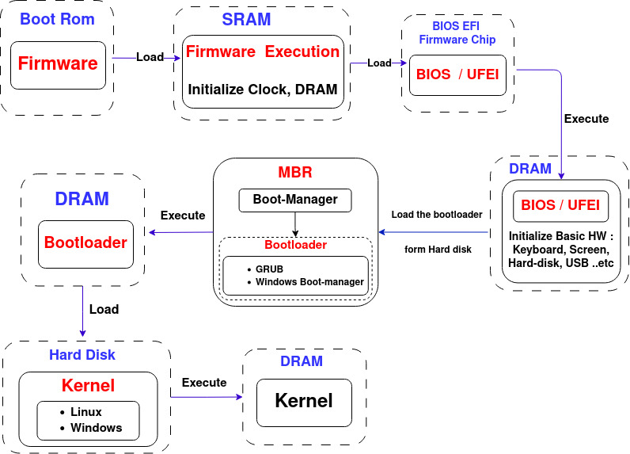

## Table of Contents

# Booting Sequence

## 1. Computer Booting Sequence (X86) 

#### 1.1. Boot-ROM Stage

When the computer is powered on (Reset), the Program counter ***PC***  starts at a predefined memory address points to a firmware application in **Boot ROM**. Then it is loaded into SRAM to execute and initializes essential hardware components (Clock, DRAM).  After that it loads the **BIOS** into DRAM and hand over the control to it .

#### 1.2. BIOS /UFEI Stage

The BIOS (Basic Input/Output System) or UEFI (Unified Extensible Firmware Interface) firmware performs a Power-On Self-Test **(POST)**. The POST checks the integrity of essential hardware components, such as the processor, memory, and storage devices.

After that The **BIOS** reads the first sector (512 bytes) of the selected storage device, which contains the  **MBR**. The **MBR** includes executable code  (bootloader) and a partition table. The BIOS transfers control to the executable code in the MBR (bootloader).

#### 1.3. Master Boot Record (MBR) or GUID Partition Table (GPT) Loading

If the selected boot device is a storage device (Hard drive, USB Flash), the BIOS or UEFI loads the initial bootloader from the Master Boot Record (MBR) for legacy systems or the EFI System Partition (ESP) for UEFI systems using the GUID Partition Table (GPT) format.

#### 1.4. Bootloader Stage

The bootloader is an application reads the partition table in the MBR / GPT to identify the active (bootable) partition. It loads the boot sector of the active partition into DRAM. It has two main responsibilities: first, loads the Kernel into DRAM and passing control to the kernel. Second,  loading new boot images into memory, and running diagnostics.  

1.5. Kernel Stage

- The operating system kernel is loaded into memory, and its initialization process begins. The kernel configures hardware, sets up the system's memory management, and initializes essential system components.

**1.6. Init Process and User Space:**

- The kernel starts the init process, which is the first user-space process. The init process, or its modern equivalents such as systemd or Upstart, initializes the user space, starts system services, and launches user applications.

## Not finished Yet , To be Continued