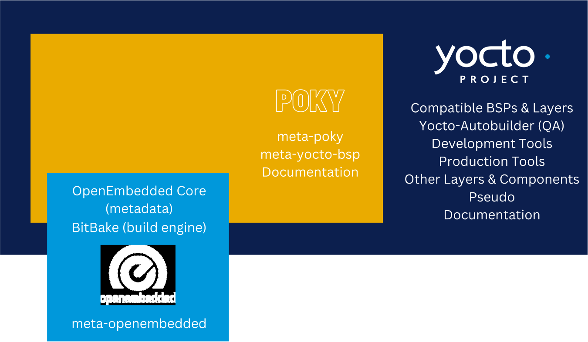
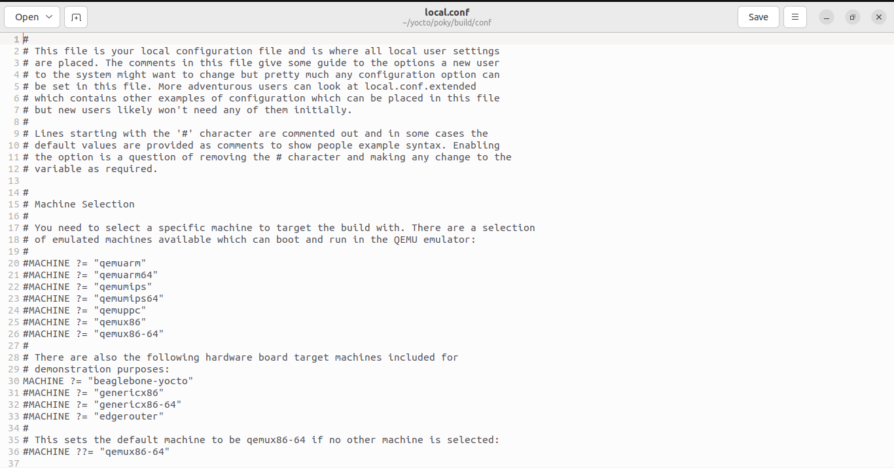
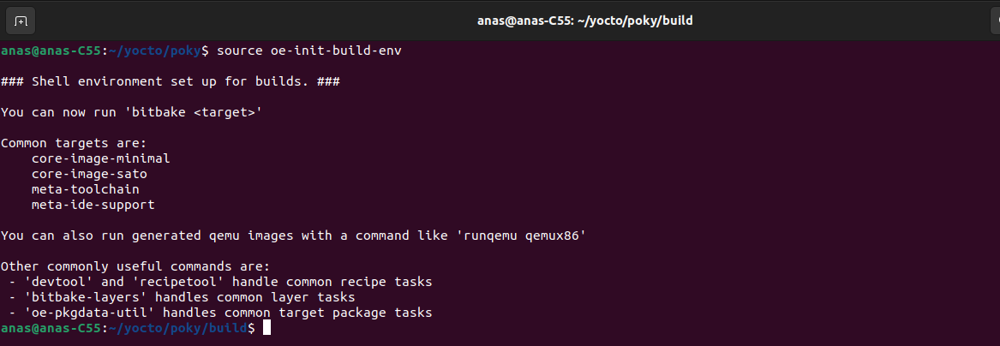
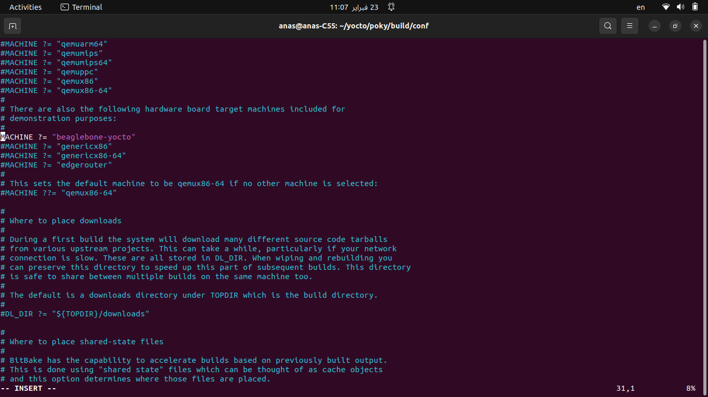
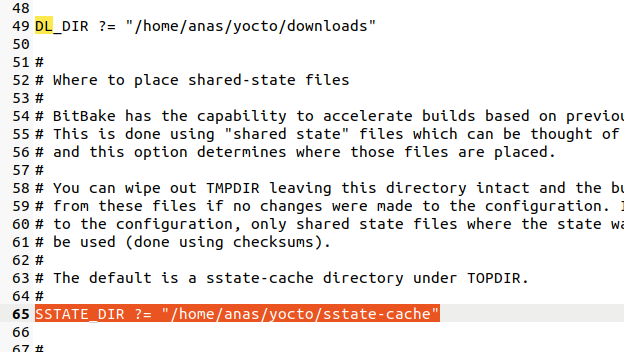
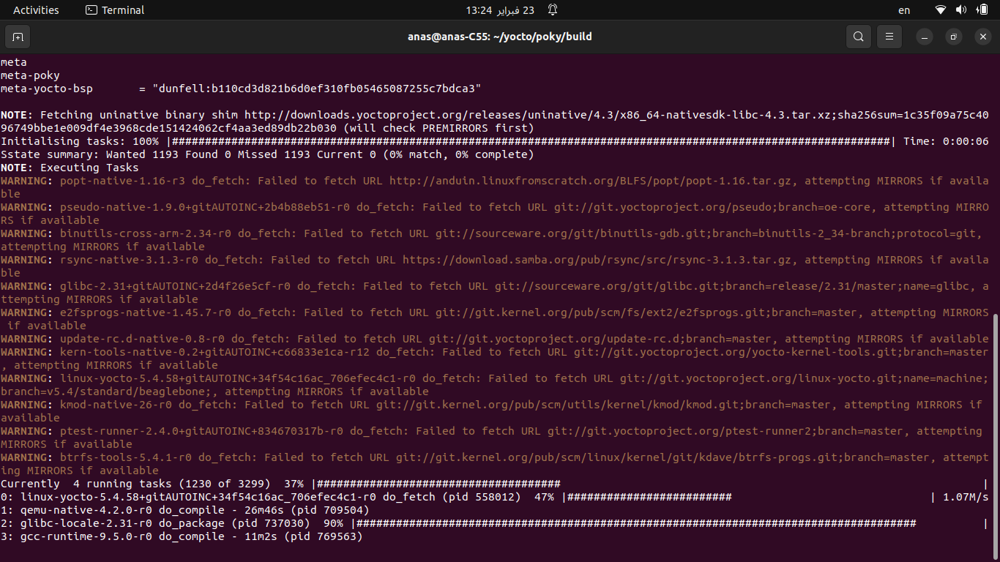

## Table of Contents 

- [**1. Revision**]()
- [**2. YOCTO **]()
  - [2.1. Advantages and Dis-Advantages of Yocto]()
  - [2.2. Yocto Main Components ]()
    - [2.2.1. OpenEmbedded (OE)]()
    - [2.2.2. Poky]()
    - [2.2.3. The difference between Yocto and OpenEmbedded ]()
    - [2.2.4. Relation between Yocto, OpenEmbedded and Poky ]()
- [**3. Yocto Terminologies** ]()
- [**4. Yocto Project Work FLow** ]()
- [**5. Install Yocto** ]()
- [References ]()


-----------------------------------------------------------------------------------------------------------------------------------------------------------

# Yocto Project


## 1. Recap 

Where are we and what is done till now in journey of building our own Embedded Linux System :


It took us a long time and effort to build the elements of our embedded Linux system (Cross Compiler, Uboot, Kernel, rootfs) So, there is a great solution to Automate building your own customized Embedded linux system (Image) like  Auto Build tools (**Build root** and **YOCTO Project**) .

To more information about the difference between Build root and Yocto  [ReadThisArticle](https://epteck.com/yocto-vs-buildroot-comparison/)

## 2. YOCTO 

The **Yocto** Project is an open-source collaboration project that provides tools to help you create custom Embedded Linux System, regardless of the hardware architecture. The primary goal of the Yocto Project is to provide developers with a  flexible and customizable framework for building embedded Linux  distributions.

Yocto was developed in 2010 by the collaboration of several hardware and  software design companies like Intel, OpenEmbedded, Texas  Instrumentation, Huawei, Wind River, Mentor Graphics and Monta Visa.

The ***Yocto*** philosophy is based on layers. Every hardware vendor (BeagleBone, Raspberry Pi) provides its layer that contains packages,  machine configurations and other things required to build Linux for  their embedded board. This layer makes support for multiple architecture easier. 


### 2.1. Advantages and Dis-Advantages of Yocto

| Advantages                                                   | Dis-Advantages                                               |
| ------------------------------------------------------------ | ------------------------------------------------------------ |
| Has a huge community support that makes Yocto development easier. | Understanding concepts such as recipes, layers, and bitbake requiring time and effort to master. |
| Multiple architecture support such as AMD, MIPS, ARM, INTEL, PPC.....etc. | Requires a large space to make yocto project. You  must have at least 50 GB free space to make the yocto build. |
| Yocto projects are easily deployable on  other architectures with a little modification. You don’t have to swap development environment for different boards in yocto. | Yocto takes a lot of time and hardware resources for build   |
| Yocto project is very customizable and expandable.           | -                                                            |
| Contains reference packages and templates for any embedded board. | -                                                            |

### 2.2. Yocto Main Components 

#### 2.2.1. OpenEmbedded (OE)

 OpenEmbedded (OE) is a **build framework** for creating custom Linux distributions specifically for embedded systems. It provides developers with tools and infrastructure to compile software packages, customize configurations, and generate complete Linux images optimized for embedded devices.

> The build framework  collection of tools, scripts, and recipes designed to automate the process of compiling software. It includes compilers, linkers, and other tools  necessary for translating source code into executable binaries. It  manages the compilation process, handling dependencies, optimizations,  and platform-specific considerations.

We can image **Open Embedded Project** as an extension (Store) for additional layers and recipes. 		It has two main components : 

- **OpenEmbedded-Core (OE-Core)**: OE-Core forms the foundational layer of the OpenEmbedded build system. It includes essential components such as metadata, recipes, scripts, and configuration files necessary for building embedded Linux distributions. OE-Core provides the core functionality required for compiling software packages, customizing configurations, and generating complete Linux images optimized for embedded devices. It serves as the base upon which additional layers can be added to extend functionality and customize distributions further.

- **BitBake**: BitBake is the task execution engine at the heart of the OpenEmbedded build system. It is responsible for parsing recipes, Scripts, resolving dependencies, scheduling tasks, and executing them in the appropriate order. BitBake uses a metadata-driven approach, where recipes specify how to build software packages and define their dependencies, source locations, and build instructions. It also supports parallel execution of tasks to optimize build times.



#### 2.2.2. Poky

**Poky** is the reference distribution of the Yocto Project, aimed at helping developers create customized Linux-based systems for embedded devices.

>**"Reference system distribution"** refers to a standardized, pre-configured system that serves as a model or example (guidelines) for developers to build embedded Linux distributions  . 

***Poky*** provides a set of components like *OpenEmbedded* Build System *(BitBake and OpenEmbedded-Core)*. Also, include pre-configured recipes (instructions for building software packages), layers (collections of recipes and configuration files), and tools that simplify the process of building and customizing Linux distributions for embedded systems. It includes essential components such as ***bootloaders, kernels, device drivers, libraries, and utilities***, allowing developers to create their own optimized distributions  for their specific hardware and application requirements.

There are many Poky releases like : Dunfell, Styhead, Kirkstone ..etc. For more Info Read [YoctoReleases](https://wiki.yoctoproject.org/wiki/Releases).

- [x] ####  The difference between Poky and OpenEmbedded 

- ##### History

  - **OpenEmbedded** originated in 2003 as a build system for handheld computers like Sharp Zaurus and Compaq iPaq, later expanding to support various embedded Linux devices.

  

  - **Poky** emerged in 2005 as a fork of OpenEmbedded, emphasizing stability and specific package choices. Initially developed by Richard Purdie at OpenedHand company, it later transitioned to the *Linux Foundation* in 2010 under Intel's ownership. While Poky and OpenEmbedded coexisted, their common components were merged into a separate project called **OpenEmbedded Core (OE-Core)** in 2010.

- **OpenEmbedded Roles in Yocto** :

  Provides a wide range of packages and layers, allowing users to create custom distributions tailored to their needs.

- **Poky Roles in Yocto**:

  Focus on stability by Selecting  reliable and compatible components and packages. This reduces the risk  of system errors and ensures reliability, also simplifies the process of building custom Linux  distributions, making it easy for developers to get started without  unnecessary complexity but offers a more limited selection of packages chosen for stability.

- **Conclusion**

  In simple terms, ***OpenEmbedded** is like a toolbox with many options (layers / packages) for building custom Linux distribution, while **Poky** is a ready-to-use package focusing on stability and simplicity. There was integration and cooperation between them under the umbrella of **Yocto***

#### 2.2.3. The difference between Yocto and OpenEmbedded 

With OpenEmbedded, you can define your own recipes, layers, and  configurations for your own Linux distribution. You can choose which software packages to include, configure system settings for your target hardware (BeagleBone ,Raspberry Pi....). You can create your own Embedded Linux system using OpenEmbedded only. But **why we use Yocto  and its components (OE-core ,Poky, Bitbake..) ?**

 Using **OpenEmbedded** may require a deeper understanding of the build system and  Linux development compared to using higher-level frameworks like the  Yocto Project. Remember the aim of **Poky** (simplifies the process of building distributions, making it easy for developers to get started without complexity) 

- **Integrated Ecosystem**: Yocto Project provides a comprehensive ecosystem of tools, and resources specifically tailored for embedded Linux development. It integrates various components such as BitBake, OpenEmbedded-Core, and Poky to streamline the development process.

- **Standardization**: Yocto Project establishes a set of standard practices and conventions for building embedded Linux systems. This standardization ensures consistency across projects and makes it easier for developers to collaborate and share code.

- **Community Support**: Yocto Project has a large and active community of developers, users, and contributors. This community provides support, shares knowledge, and contributes to the development of the project, making it easier to troubleshoot issues and find solutions.

- **Layered Architecture**: Yocto Project's layered architecture allows for modular customization. Developers can add or remove layers containing recipes, configuration files, and metadata to tailor the distribution to their specific requirements.

#### 2.2.4. Relation between Yocto, OpenEmbedded and Poky 


## 3. Yocto Terminologies 


- **Meta data** : 

  metadata provides the necessary information for the build system to  understand how to compile software, configure system settings, and  generate the final Linux distribution for embedded systems. It plays a  crucial role in customizing and managing the build process within  frameworks like OpenEmbedded and the Yocto Project.

- **Recipes** (**.bb and .bbappend**): Recipes are metadata files that specify how software packages should be built. They contain information such as the source URL, version, dependencies, patches, and build instructions. Also includes where to fetch the source code, how to configure and compile it, and how to package the resulting binaries.

- **Configuration Files**: Configuration files provide settings and options for customizing the build process, system settings, and package selection. These files often use formats like `.conf` and can be used to define variables, set build flags, or enable/disable features.

  - **local.conf**:

    It allows users to customize  target architecture, target machine, package selection, build options, and environment variables.

    

  - **machine.conf**:

    - `machine.conf` files contain hardware-specific configurations for target machines.

    - They define settings such as CPU architecture, memory size, and hardware peripherals.

    - Each target machine may have its own `machine.conf` file to ensure that the Linux distribution is optimized for that particular hardware platform.

  - **distro.conf**:

    - `distro.conf` files contain distribution-specific configurations and policies.

    - They define settings related to the overall distribution, such as package management preferences, default package selections, and repository configurations.

    - `distro.conf` files help maintain consistency across different distributions built using OpenEmbedded.

  - **layer.conf**:

    - `layer.conf` files are used to configure layers within the OpenEmbedded build system.

    - They define metadata for layers, including layer dependencies, recipes, classes.

    - `layer.conf` files ensure that layers are properly integrated into the build system and can be easily managed and extended.

  - **auto.conf** and **site.conf**:

    - `auto.conf` and `site.conf` files are automatically generated during the build process.

    - `auto.conf` contains configuration settings derived from the build environment, such as host system information and build flags.

    - `site.conf` contains configuration settings specified by the user or system administrator, typically added via the `conf/site.conf` file.

- **Layers **: contain collections of recipes, configuration files, and other metadata. Layer configuration files define relationships between layers, dependencies, and additional metadata specific to the layer. Layers provide a mechanism to isolate metadata according to functionality

  - **Base Layers** :

    Base layers provide foundational components and resources for building embedded Linux distributions. They typically include essential metadata, recipes, and configuration files required to bootstrap the build system and set up basic functionality. Base layers often serve as starting points for creating custom distributions.

  - **Platform Layers :**

    Platform layers contain hardware-specific configurations, drivers, and support for particular hardware platforms or architectures. These layers define settings such as kernel configuration, bootloader parameters, device tree files, and hardware-specific utilities necessary for running Linux on specific embedded devices.

  - **Application Layers:**

    Application layers contain recipes and configurations for user-space applications, libraries, and utilities. These layers include software packages tailored for specific use cases or application domains, such as multimedia, networking, IoT, or industrial automation. Application layers allow developers to easily integrate and customize software components for their embedded systems.

  - **Integration Layers:**

    Integration layers focus on integrating and testing components from various sources, such as upstream projects, third-party vendors, or community contributions. These layers ensure compatibility, resolve dependencies.

  - **Customization Layers:**

    Customization layers are created by developers to tailor the Linux distribution to specific project requirements (for example create layer for non-supported hardware).  Customization layers allow developers to add new features, apply patches, configure system settings, or include proprietary software components.

- **Tool Chain**

  Toolchain refers to a set of  tools used to compile, link, and debug software. The Yocto Project can  generate custom toolchains tailored to specific hardware architectures  and software configurations.

- **Packages**:

  They are compiled binary files containing software components, libraries, executables, configuration files, and metadata required for installation and execution on embedded Linux systems. These packages are typically generated during the build process using the Yocto Project's build system and are tailored to the specific requirements of the target hardware and software environment.

  - **Package Management**: The Yocto Project includes tools such as **opkg, dpkg, rpm, and ipkg** for managing packages on embedded Linux systems. These package managers handle the installation, removal, and upgrading of software packages, as well as dependency resolution and version tracking.

  - **Package Generation**: Within the Yocto Project's build system, packages are generated from recipes, which specify how software components should be compiled, configured, and packaged. Recipes define the build process, source URLs, patches, dependencies, and other parameters necessary for generating packages.

  - **Package Metadata**: Metadata about packages includes information such as package name, version, dependencies, license information, and other attributes necessary for package management and integration into the system.

- **Classes (.bbclass)**:
  - Classes are reusable pieces of metadata that provide functionality or behavior that can be applied to multiple recipes.
  - They are defined in `.bbclass` files and contain tasks, variables, and functions that can be inherited by recipes.
  - Classes are used to encapsulate common functionality such as patching, building, testing, or packaging.
- **Includes (.inc)**:
  - Includes are similar to classes but typically used for smaller, more specific pieces of functionality.
  - They are defined in `.inc` files and can contain variables, functions, or other metadata.
  - Includes are often used to share common code snippets or configuration settings across multiple recipes or classes.

## 4. Yocto Project Work FLow to generate Image


### 4.1. User Configuration

In the Yocto Project, user configuration refers to the choices and  settings developers define to configure the build process. Using configuration files such as `local.conf`, developers specify details like the target architecture, source code locations, and various build options. 

### 4.2. Meta data Layers

- **Metadata Layer**:

  - A metadata layer in the Yocto Project is a collection of metadata, recipes, configuration files, and other resources that define how software components are built and integrated into the Linux distribution.

  - Examples of metadata layers include base layers (such as OpenEmbedded-Core), platform-specific layers, application layers, and custom layers created by developers to encapsulate project-specific customizations and modifications.

- **Machine BSP Layer**:

  - The Machine BSP (Board Support Package) layer in the Yocto Project contains metadata and configurations specific to the target hardware platform or machine architecture.
  - This layer defines how software components should be configured and optimized to run on the target hardware, including kernel configuration, device tree (DTB) settings, bootloader configurations, and other platform-specific parameters.
  - Machine BSP layers allow developers to create custom board support packages tailored to different hardware platforms, ensuring optimal performance and compatibility with target devices.

- **Policy Configuration Layer**:

  - The Policy Configuration Layer in the Yocto Project contains policies, rules, and configurations that govern the behavior and settings of the build system.

  - This layer defines policies related to security, licensing, package management, dependency resolution.

### Bitbake

BitBake parses files from configuration layers to understand the  metadata, recipes, and configuration settings specified within these  files. By parsing these configuration files, BitBake extracts information such  as target architecture, preferred toolchain, compiler flags, package  selection, layer directories, and build options. This information is  used by BitBake to configure the build environment, determine task  execution order, resolve dependencies, and generate the necessary tasks  for building the custom Linux distribution. 

### 4.3. Source Files

The build system is responsible for fetching and downloading the source code of software components from specified locations. The build system supports standard methods for retrieving source code, including tarballs (compressed archive files) and source code repository systems such as Git.

When building a custom Linux distribution, developers specify the source locations of the software components they want to include in the distribution. These source locations can point to remote repositories or URLs where the source code is hosted. The build system then automatically retrieves the source code from these locations during the build process.

For source code hosted in Git repositories, the build system uses Git protocols to clone the repository and fetch the required source files. This allows developers to work with version-controlled source code repositories and easily manage dependencies and updates.

### 4.4. Build System 

**Source Code Extraction**:

The fetched source code is extracted into a local work area where the build system can manipulate and modify it.

**Patch Application**:

Patches are applied to the source code to customize or modify the software to meet specific requirements with the target hardware environment.

**Configuration**:

Common steps for configuring the software are performed, including setting build options, defining compilation flags, specifying dependencies, and configuring other aspects of the software's build process.

**Compilation**:

Once the software is configured, the build system initiates the compilation process. This involves translating the source code into executable binaries or libraries.

These processes are under the control of BitBake. BitBake fetches source files, applies patches, completes compilation, analyzes output for package generation, creates and tests packages, generates images, and generates cross-development tools.

> BitBake is not a build system itself; rather, it is a task execution engine that helps with the build process. While BitBake plays a central role, it works alongside other components such as OpenEmbedded-Core, Poky, and layers to form a complete build system for creating custom Linux distributions for embedded systems.

#### 4.4.1. QA Test

QA (Quality Assurance) tests refer to various verification and validation processes performed to ensure the quality, correctness, and reliability of the generated software. These tests are integrated into the build process to detect errors, identify issues, QA tests in the Yocto build system include:

- **Build Verification Tests (BVT)**: BVTs ensure that the build process completes successfully without errors or failures. These tests verify basic functionality, such as compiling source code, generating packages, and creating images.

- **Functional Testing**: Functional tests assess the behavior and functionality of the software components. They execute predefined test cases and scenarios to validate that the software behaves as expected and meets functional requirements.

- **Integration Testing**: Integration tests evaluate the software components within the overall system. These tests verify that individual modules work together seamlessly and perform as intended in the integrated environment.

- **Regression Testing**: Regression tests ensure that recent changes or modifications to the software codebase have not introduced new bugs or regressions. They compare the current behavior of the software against previous versions to identify any unintended changes or deviations.

- **Performance Testing**: Performance tests measure the runtime performance, resource utilization, and scalability of the software under various conditions. They assess factors such as execution speed, memory usage, and system responsiveness to ensure optimal performance.

- **Security Testing**: Security tests evaluate the resilience of the software against security threats and vulnerabilities. They identify potential security risks, such as code vulnerabilities or configuration weaknesses, and help mitigate them to enhance the overall security posture of the system.

- **Compliance Testing**: Compliance tests verify that the software adheres to relevant industry standards, regulations, and compliance requirements. They ensure that the software meets specific certification criteria and complies with legal and regulatory obligations.

### 4.5. Package Feeder

 After the binaries are created during the build process in the Yocto  Project, the build system generates a binary package feed. This package  feed consists of directories containing output packages in formats such  as **RPM, DEB, or IPK**. These packages contain compiled software  components, libraries, and other necessary files.

The packages within the package feeds used in construction of images or SDKs. Package feeds can be copied and shared using ,  web servers or package repositories. This allows for the distribution and deployment of software updates or extensions to existing images on devices at runtime.

This means that developers can use the pre-built software packages available in the package feeds to add new features, update existing software, or fix bugs on embedded devices without having to rebuild the entire operating system from scratch.

>re-built software packages are generated during the build process and  stored in package feeds. These packages contain compiled binaries,  libraries, configuration files, and other necessary files needed to run  the software on the target device.

**"For example, if a developer wants to add a new application to an embedded device, they can simply install the corresponding package from the package feed without needing to rebuild the entire system image."**

### 4.6. Image and SDK 

- **Images**: Images are the final outputs of the development process. They consist of all the necessary components to run an operating system on the target device such as: **kernel image, bootloader, root file system (rootfs),** and any other required configurations or applications. Images are typically flashed onto the target device's storage media.
- **Application Development Kit SDK**: This is a set of cross-development tools generated during the build process. These tools allow developers to build and debug applications that will run on the target device. The SDK includes compilers, debuggers, libraries, headers, and other development tools necessary for software development. It enables developers to create and test software applications in a development environment (Host machine : Computer) separate from the target device before deploying them onto the actual embedded system.

## 5. Install Yocto Project 

- **Setting the Environment**

  >- Free Space 50 GigaByte Minimum
  >
  >- Linux Distribution (Ubuntu for example)
  >
  >- Git Version 1.8.3.1 or greater
  >
  >- tar Version 1.27 or greater
  >
  >- Python  Version 3.4.0 or greater.

  ```bash
  sudo apt-get install gawk wget git-core diffstat unzip texinfo gcc-multilib build-essential chrpath socat cpio  python3 python3-pip python3-pexpect 
  ```

  >1. **apt-get**: This is a command-line tool for managing software packages on Debian-based Linux distributions, such as Ubuntu. It's used to install, remove, and upgrade software packages, as well as to perform other package management tasks.
  >2. **install**: This is a subcommand of `apt-get` that tells it to install the specified packages.
  >3. **gawk**: GNU implementation of the awk  language, used for text processing and pattern matching.
  >4. **wget**: Command-line utility for downloading files from the internet. It supports downloading via HTTP, HTTPS, and FTP protocols.
  >5. **git-core**: The core components of the Git version control system, used for tracking changes in files and coordinating work among multiple people. Note: In some distributions, the package may be named simply 'git' instead of 'git-core'.
  >6. **diffstat**: Utility that provides statistics on changes made to files using the diff command. It's often used to summarize the output of version control system changes.
  >7. **unzip**: Tool for extracting files from ZIP archives. It can handle both ZIP files created by the zip compression utility and those created by PKZIP.
  >8. **texinfo**: System for producing documentation in various formats, including plain text, HTML, and PDF. It's commonly used for creating documentation for software projects.
  >9. **gcc-multilib**: Cross-compilation support for GCC (GNU Compiler Collection), enabling the building of programs for multiple architectures. This package provides support for building software that can run on both 32-bit and 64-bit systems.
  >10. **build-essential**: Meta-package that installs essential tools for building software, including compilers, make, and other necessary utilities. It's often one of the first packages installed on a new development system.
  >11. **chrpath**: Utility for modifying the rpath or runpath in executables. It's used to change the path to shared libraries that an executable uses at runtime.
  >12. **socat**: Tool for establishing bidirectional data transfer between two independent data channels. It's often used for networking tasks and debugging.
  >13. **cpio**: Archiving utility used to create or extract archives. It's commonly used in conjunction with the GNU Tar utility for working with compressed archives.
  >14. **python3**: Python 3 interpreter, which allows you to run Python scripts and applications written in Python 3.
  >15. **python3-pip**: Package installer for Python 3, used for installing Python packages from the Python Package Index (PyPI). It simplifies the process of managing Python packages and their dependencies.
  >16. **python3-pexpect**: Python module for controlling interactive programs, useful for automating tasks that involve user input. It's commonly used for scripting interactive command-line applications.

- Create Directory Called **"yocto"** in Home directory  and go to it

  ```bash
  mkdir yocto && cd yocto
  ```

  


- Download Yocto project from yocto project Repo and go to poky directory

  ```bash
  git clone -b dunfell https://git.yoctoproject.org/git/poky.git
  cd poky
  ```

  >When you run this command, Git will clone the `dunfell` branch of the Poky repository from `https://git.yoctoproject.org/git/poky.git` into a directory named `poky` in your current working directory. You'll have a complete copy of the  repository, including all its branches and commit history, on your local machine.
  >
  >- **git clone**: This is the Git command used to clone a repository from a remote location to your local machine. It creates a copy of the repository along with all its branches and history.
  >
  >- **-b dunfell**: This option specifies the branch to clone. It tells Git to clone the `dunfell` branch of the repository.
  >
  >- **https://git.yoctoproject.org/git/poky.git**: This is the URL of the repository you want to clone. It starts with `https://` indicating that it's accessed over HTTP. `git.yoctoproject.org` is the domain of the server hosting the repository, `git` is the project name, and `poky.git` is the name of the repository.

- **Setup Poky Environemt **

  ```bash
  source oe-init-build-env
  ```

  >The command `source oe-init-build-env` is used to set up the environment for building software with the Yocto Project's Poky build system. Here's what it does and why it's necessary:
  >
  >1. **Sets up environment variables**: When you run `source oe-init-build-env`, it executes a script called `oe-init-build-env` that sets up various environment variables needed for the build process. These variables include paths to tools, configuration options, and other settings required by Poky and the Yocto Project.
  >2. **Configures the build environment**: The script may prompt you to choose a directory for storing build output and other configuration options. Once you've made your selections, it configures the build environment accordingly.
  >3. **Provides access to build tools**: By sourcing `oe-init-build-env`, you ensure that the necessary build tools and scripts are available in your shell session. This allows you to run commands like `bitbake` (the main build tool used by Poky) and other Yocto Project utilities from any directory within the build environment.
  >
  >

- **Edit in Configuration file (local.conf )**

  ```bash
  cd conf
  vim local.conf
  ```

  - **Change the Target Machine from qemux86-64 to beaglebone-yocto**

    

    >Setting the `MACHINE` variable to "beaglebone-yocto" in your `local.conf` file within a Yocto Project setup indicates to Yocto that you want to  build an image specifically for the BeagleBone platform. When  you specify this machine name, Yocto will automatically include the  necessary layers that contain recipes, metadata, and configurations  required to support the BeagleBone hardware.

  - **Change the directory of yocto Downloads and Shared state files**

    .svg)



- **Build Yocto Project **

  ```bash
  bitbake -k core-image-minimal
  ```

  > - **bitbake**: This is the command-line tool used to execute tasks within the Yocto build system. It's responsible for parsing recipes, resolving dependencies, scheduling tasks, and executing the build process.
  >
  > - **-k**: This is an option that instructs `bitbake` to continue building other tasks even if one of the tasks fails. Without this option, `bitbake` would stop execution if it encounters an error during the build process.
  >
  > - **core-image-minimal**: This is the target to build. In the Yocto Project, a "core image" refers to a minimal image that contains only essential components required for booting and running a basic system. The `core-image-minimal` target typically includes a minimal set of packages and configurations necessary to bring up a functional system.
  >
  > When you run `bitbake -k core-image-minimal`, here's what happens:
  >
  > - BitBake starts by parsing the recipe for the `core-image-minimal` target, which defines the components and configurations needed for the minimal image.
  > - BitBake resolves dependencies for the `core-image-minimal` target, ensuring that all required packages and components are available.
  > - BitBake schedules tasks to fetch, compile, and package the software components specified in the `core-image-minimal` recipe.
  > - The build process proceeds, with BitBake executing each task sequentially.
  > - If an error occurs during the build process, the `-k` option allows BitBake to continue building other tasks instead of halting the entire process.
  > - Once all tasks have been completed successfully (or as many as possible, depending on errors encountered and the `-k` option), BitBake generates the `core-image-minimal` executable, which is typically a bootable disk image containing the minimal system.





## References 

1.  https://epteck.com/yocto-vs-buildroot-comparison/
2.  https://github.com/yasminehelmy2001/Embedded_Linux/tree/master/EmbeddedLinux/07.Yocto
3.  https://subscription.packtpub.com/book/iot-and-hardware/9781785281952/1/ch01lvl1sec10/yocto-project-workflow
4.  https://docs.yoctoproject.org/2.5/overview-manual/overview-manual.html
5.  http://simple-is-beauty.blogspot.com/2017/10/poky-vs-yocto-vs-openembedded.html
6.  https://www.yoctoproject.org/development/technical-overview/
7.  https://www.windriver.com/solutions/learning/yocto
8.  https://kickstartembedded.com/2021/12/19/yocto-part-1-a-definitive-introduction/?amp=1