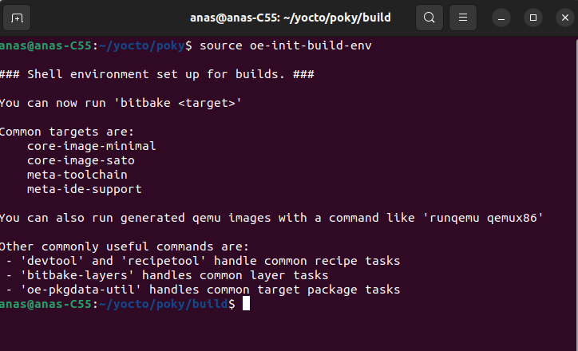
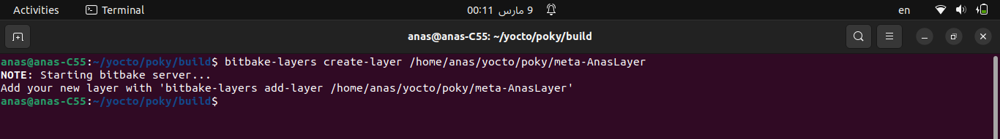
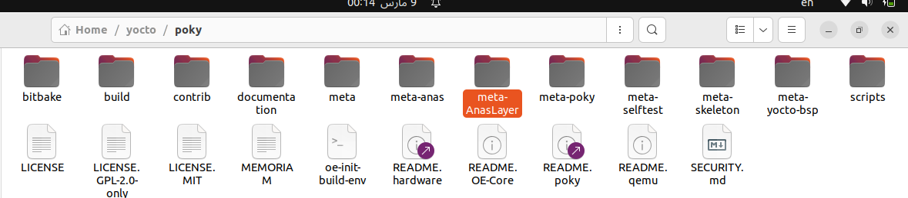
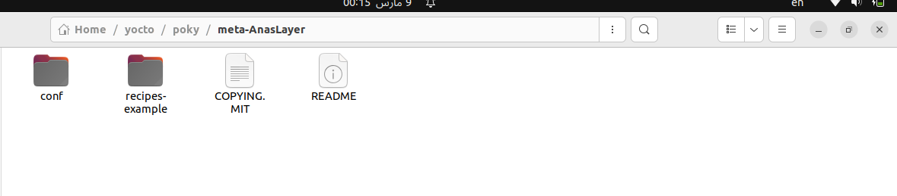
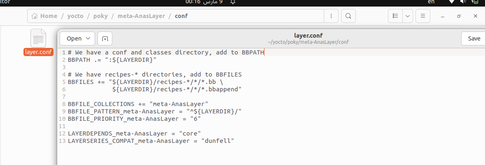
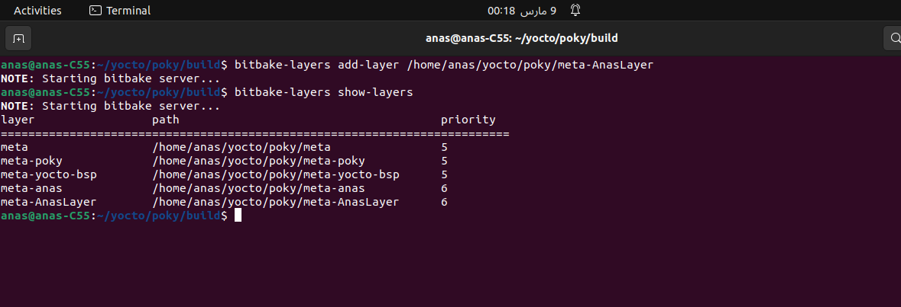

# Yocto


-----------------------------------------------------------------------------------------------------------------------------------------------------------

## Table of content


-----------------------------------------------------------------------------------------------------------------------------------------------------------

# 1. Layers

To remember what is the Yocto Layers Read This [Part](https://github.com/anaskhamees/Embedded_Linux/tree/main/EmbeddedLinuxTasks/10.Yocto/10.1.Yocto_Introduction#3-yocto-terminologies)

### 1.2. Create Layer

```bash
bitbake-layers create-layer <path/to/meta-layername>
```

- Go to `poky` directory and source the script:

  ```bash
  source oe-init-build-env
  ```

  

- In my case I created Layer in `/home/anas/yocto/poky` , Called `AnasLayer`

```
bitbake-layers create-layer /home/anas/yocto/poky/meta-AnasLayer
```

>Note that you must start the Layer name by **meta-**







Poky Created a reference of an example recipe in your layer and `layer.conf` file is created also.



- Add Your Layer in Poky

  ```bash
  bitbake-layers add-layer <path/to/meta-layername>
  ```

  ```
  bitbake-layers add-layer /home/anas/yocto/poky/meta-AnasLayer
  ```

  

- Make sure that the Layer Created 

  ```
  bitbake-layers show-layers
  ```

  