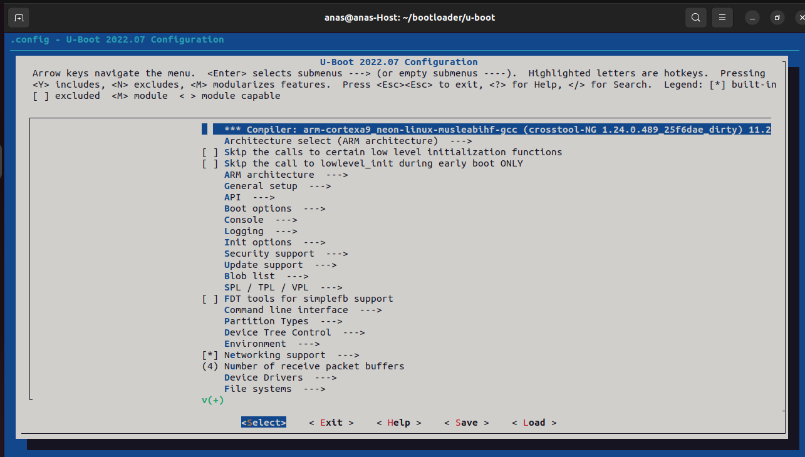
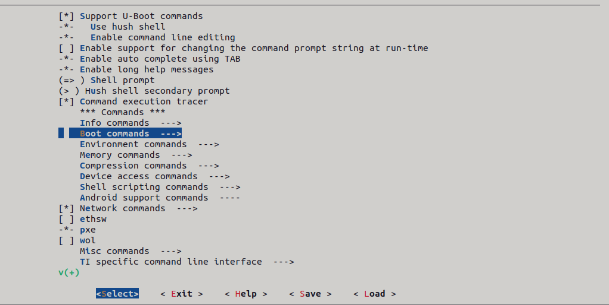
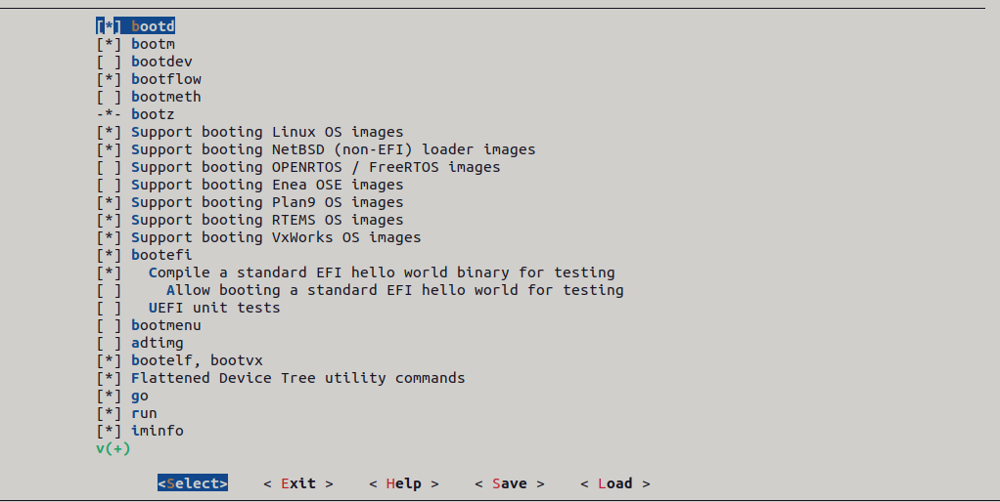
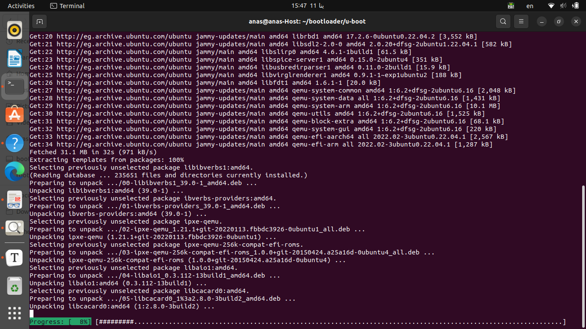
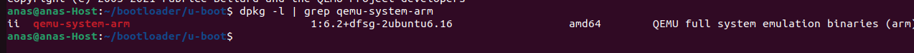

## Table of Contents 


-----------------------------------------------------------------------------------------------------------------------------------------------

# U-boot (Bootloader)

Generally the bootloader is an application reads the partition table in the MBR / GPT to identify the active (bootable) partition. It loads the boot sector of the active partition into DRAM. It has two main responsibilities: first, loads the Kernel into DRAM and passing control to the kernel. Second,  loading new boot images into memory, and running diagnostics.  

U-Boot, short for Das U-Boot (German for "The U-Boot"), is an open-source bootloader widely used in embedded systems, particularly in the realm of embedded Linux. It plays a crucial role in the boot process of these systems. It perform various low-level hardware initialization tasks and  boot the device's operating system kernel. It is available for a number  of computer architectures, including 68k, ARM, Blackfin, MicroBlaze,  MIPS, Nios, SuperH, PPC, RISC-V and x86.

> I suggest you to take a look on the booting sequence to understand the importance of bootloader.


### 1. Booting Sequence

#### 1.1. Computer (x86) Booting sequence 

.jpg)


#### 1.2. BeagleBone Booting Sequence


### 2. Install U-boot

##### 2.1. Cloning the U-boot Repository

```g
git clone git@github.com:u-boot/u-boot.git
```

> - **`git clone`:** This is the Git command used for cloning a repository. It creates a copy of a Git repository, including all of its files, commit history, and branches.
> - **`git@github.com:u-boot/u-boot.git`:**
>   - **`git@github.com`:** This part specifies the Git protocol and the host from which to clone the repository. In this case, it indicates that the repository is hosted on GitHub.
>   - **`u-boot/u-boot.git`:** This part specifies the path to the repository on GitHub. In this case, it points to the U-Boot repository, which is named "u-boot.git." The format is `username/repo`.
>
> So, when you run this command, Git will connect to the GitHub repository at `git@github.com:u-boot/u-boot.git`, download all the files, and set up a local copy on your machine. The local copy will be placed in a directory named "u-boot," and you can then navigate into that directory to work with the cloned repository.


##### 2.2. Go to U-boot directory

```
cd u-boot/
```

##### 2.3. Switch to specific (stable) branch of U-boot Repository (v2022.07)

```
git checkout v2022.07
```

>- **`git checkout`:** This Git command is used for switching between branches or checking out specific  branches.
>- **`v2022.07`:** This is the tag or commit identifier you are checking out. In Git, tags are often used to mark specific releases or versions of a project. In this context, `v2022.07`refers to the U-Boot release version from July 2022.


##### 2.4. U-boot Machine Configurations

```
ls configs/ | grep [your machine] 
```

>The command is used to list and filter U-Boot configuration files based on a specific machine or target platform. Let's break down the components of the command:
>
>- **`ls configs/`:** This part of the command uses the `ls` (list) command to display the contents of the `configs/` directory. The `configs/` directory typically contains configuration files for various target machines(x86, Vexpress, Raspberry Pi, BeagleBone.....etc).
>- **`|`:** This is the pipe symbol, and it is used to pass the output of the `ls` command as input to the `grep` command.
>- **`grep [your machine]`:** `grep` command to search for lines in the output of `ls` command, which in this case, is `[your machine]`. The square brackets `[]` indicate a placeholder where you would substitute the actual name of your target machine.


- **In my case I use Vexpress Cortex A9 (Qemu Emulator)**

```
ls configs/ | grep vexpress_ca9x4_defconfig
```


- Set the cross compiler into environment variables to enable the U-boot to use it

  >  Remember we use ARM compiler (arm-cortexa9_neon-linux-musleabihf) 
  >
  > ```
  > export CROSS_COMPILE=path/to/cross/compiler/arm-cortexa9_neon-linux-musleabihf-
  > ```

```python
#In my case
export CROSS_COMPILE=~/x-tools/arm-cortexa9_neon-linux-musleabihf/bin/arm-cortexa9_neon-linux-musleabihf-
```

>- **`export`:** This is a shell command used to create environment variables(global). 
>
>- **`CROSS_COMPILE=`:** This sets the environment variable named `CROSS_COMPILE`. 
>
>- **`~/x-tools/arm-cortexa9_neon-linux-musleabihf`:** It is the path to a cross-compilation toolchain. 
>
>  - `arm-cortexa9_neon`: Specifies the ARM Cortex-A9 processor architecture with NEON SIMD (Single Instruction, Multiple Data) extension.
>  - `linux`: Indicates that the compiler generates binaries for the Linux operating system.
>  - `musleabihf`: Suggests the use of the musl libc library and the hard float ABI (Application Binary Interface) for ARM.
>  - **`bin/`:** the `bin/` subdirectory typically contains the cross-compiler binaries (gcc, ar, as...) .
>  - Ensure that the path ends with a hyphen (`-`), as it is part of the standard convention for cross-compilation toolchains.
>
>  The `~` at the beginning of the path represents the user's home directory.

```
export ARCH=arm
```

>Specify the architecture of the target to be ARM architecture 


- Use the default configurations of ARM Vexpress Cortex A9

  ```
  make vexpress_ca9x4_defconfig
  ```

  

> If you faced this error when run the above command :
>
> 
>
> [SOLVED] : select the correct path of the cross compiler of arm


##### 2.5. U-boot Configurations

```
make menuconfig
```

A user interface window will open , customize U-Boot for your specific board. You can try and select your options.



 

- **But there are mandatory option must be selected** :

  

- [x]  Support **bootd**.

  > `bootd` is a U-Boot command used to boot an operating system image from a device.

  - Select ***Command line interface*** :

    

  - Select ***Boot commands*** :

    

  - Select ***bootd*** and ***run*** : 

    

- [x]  Support **editenv**.

  > `editenv` is a U-Boot command that allows the user to interactively edit the U-Boot environment variables.

  - Select return to the home menu and Select ***Command line interface*** :

    

  - Then select ***shell prompt***  to appears "ITI_INTAKE44=>":

    

  - Select ***Environment commands*** :

    

  - Select ***editenv***  and ***saveenv*** :

    

- [x]  Store the environment variable inside file call **uboot.env**.

  >uboot.env  is a file that stores U-Boot environment variables persistent across reboots and these variables can be saved to and loaded from a file to maintain their values across power cycles.

  -  ***Select Enviroments*** and then make surename of FAT file is ***uboot.env***:

    

- [x] Unset support of **Flash** .

  >U-Boot should be configured without support for flashing firmware to the flash memory of the target device. This implies that U-Boot will not  include functionality for writing or updating firmware to the  non-volatile memory (flash memory) on the board.

  -  **You can select (press Y)and un-select(press space) the options.**

    - Select  ***Environment*** :

      

  - Un select  ***Environment in flash memory*** :

    

- [x] Support **FAT file system** 

  

- [x] Configure **Memory Commands** :

  

  - Then Select ***md5sum and meminfo*** :

    

  - [x] Configure **Device access commands** :

    

    - Select ***lsblk***  option :

       

  - [x] Configure the **FAT** interface to **mmc** .

    >Configuring the FAT interface to work with MMC (MultiMediaCard) storage  devices in U-Boot involves specifying settings that allow U-Boot to  interact with MMC devices and access the FAT file system on a specific  partition

    -  Default name is mmc (you can change the name as you want) :

      

  - [x] Configure the partition where the fat is store to **0 : 1** .

    >U-Boot needs to know the specific partition on the MMC device where the FAT file system is stored.

  - Select ***Device and partition for where to store the environment in FAT*** :

    

    -  Then  **Write 0 : 1 ** :

      

- [x] Configure The time delay to Auto boot

  - Select  ***Boot options*** 

    

  - Select ***Auto boot*** option and select you preferred time delay ( ***5 seconds*** )

    

  

- [x] Configure ***bootcmd value*** to print default value on the screen when booting :

  - Select ***Boot options*** 

    

- Then Write which you want (in my case "from Anas to world, helloooooo")

  

- Remove the written commands and rewrite which you want:

  

- **Congratulations ! , the all configurations are DONE **

##### 2.6. Build U-boot

```
make
```

> **You may face this error** : 
>
> fatal error: openssl/evp.h: No such file or directory
>  1184 | #  include <openssl/evp.h>
>
> - The OpenSSL library is missing on your Linux system, you should install it.

- [SOLVED] : run this command below

  ```
  sudo apt-get install libssl-dev
  ```

  

- Successful Build :

  - You will see the building process like that :

    

  - Warnings messages may appears [ignore it] :

    

##### 3. Test *U-boot* over *Vexpress-a9* machine using *Qemu* emulator

##### 3.1. Install Qemu 

If you don't install qemu before, you will face this error :

 

- [SOLVED] : run this command

  ```
  sudo apt install qemu-system-arm
  ```

  >The command  is used to install the QEMU emulator for the ARM architecture on a Debian-based Linux system, such as Ubuntu. 
  >
  >- `sudo`: This is a command that allows a permitted user to execute a command as the superuser or another user, as specified by the security policy.
  >- `apt`: This is the package management tool used on Debian-based systems to handle the installation, removal, and upgrading of software packages.
  >- `install`: This is an argument for `apt` indicating that you want to install a package.
  >- `qemu-system-arm`: This is the name of the package you want to install. It includes the QEMU emulator for the ARM architecture.
  >
  >

  The installation will be like that :

  

- Make sure the *qemu-system-arm* installed correctly run this command:

  ```
  qemu-system-arm --version
  ```

  

OR

```
dpkg -l | grep qemu-system-arm
```

>when you run this command, you are essentially asking the system to list all installed packages and then filter the results to show only those lines that contain the string **"qemu-system-arm."**
>
>If the QEMU emulator for ARM (`qemu-system-arm`) is installed, you should see one or more lines in the output that contain information about the installed package.



##### 3.2. Run ***qemu*** with Emulated SD card

```
qemu-system-arm -M vexpress-a9 -m 128M -nographic -kernel path/u-boot -sd path/sd.img
```

>- `qemu-system-arm`: This is the command to run the QEMU emulator for the ARM architecture.
>
>- `-M vexpress-a9`: Specifies the machine type to emulate. In this case, it's the Versatile Express (vexpress) development board with an ARM Cortex-A9 processor.
>
>- `-m 128M`: Sets the amount of RAM available to the emulated system. In this case, it's 128 megabytes.
>
>- `-nographic`: Disables graphical output and redirects the console to the terminal. This is useful for text-based interaction with the emulated system.
>
>- `-kernel u-boot/u-boot`: Specifies the kernel image to be used. Here, it points to the U-Boot bootloader (`u-boot/u-boot`).
>
>- `-sd sd.img`: Attaches a virtual SD card to the emulated system. The SD card image is specified by the file `sd.img`.
>
>- Make sure you mounted the Virtual SD card
>
>  > **Note That** : you should created a virtual SD before , if you didn't create it click [Here](https://github.com/anaskhamees/Embedded_Linux/tree/main/EmbeddedLinuxTasks/Virtual_SD_Card) to create it.

```
qemu-system-arm -M vexpress-a9 -m 128M -nographic -kernel u-boot -sd sd.img
```


##### 3.3. Booting 


**Congratulation ! , the U-boot is running :)**  

### 4. References 

1. https://docs.u-boot.org/en/latest/
2. https://github.com/FadyKhalil/EmbeddedLinux/tree/main/3-Uboot#vexpress-a9-qemu
3. https://github.com/PacktPublishing/Mastering-Embedded-Linux-Programming-Third-Edition
4. https://github.com/u-boot/u-boot