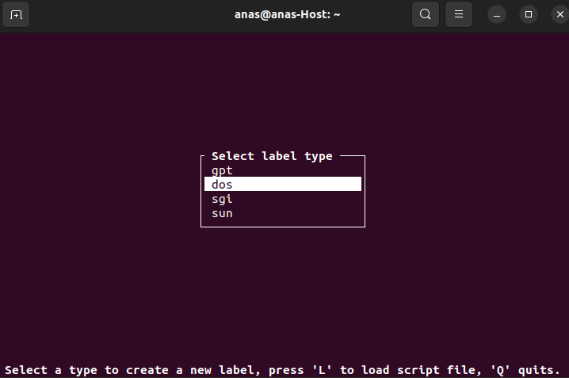
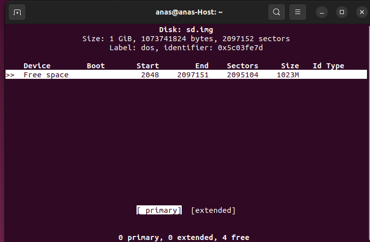
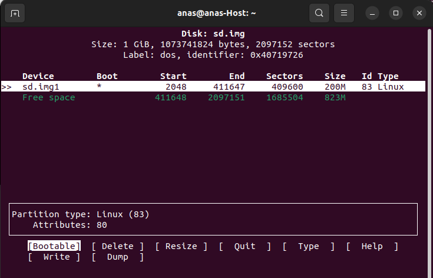
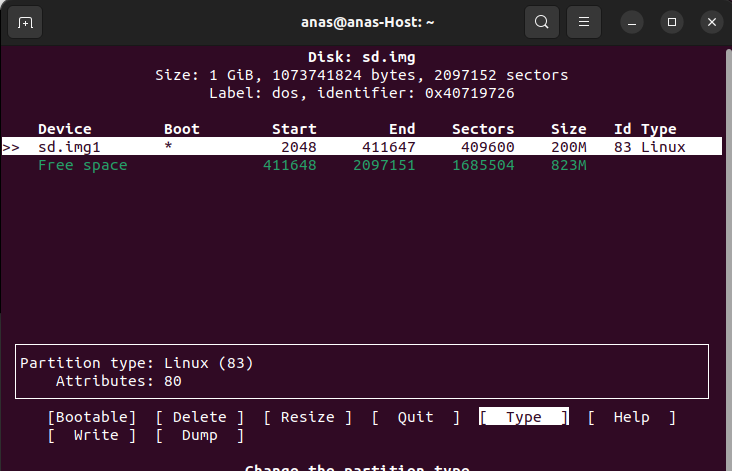
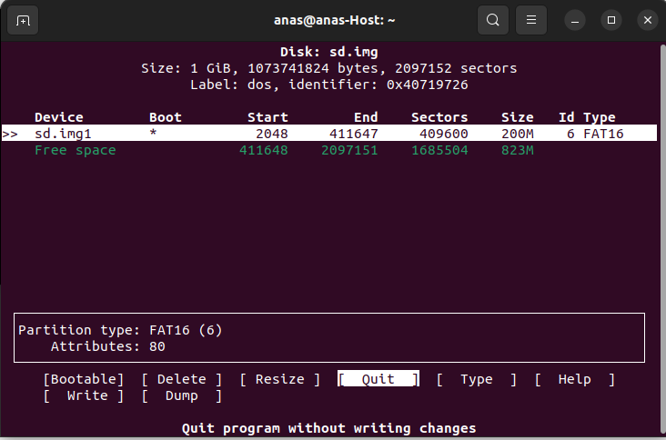
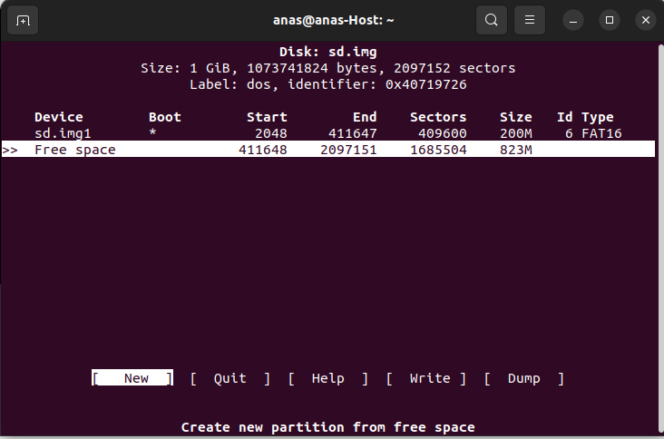
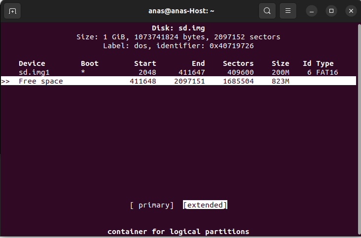
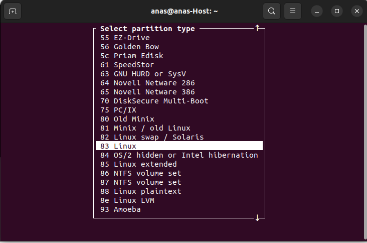
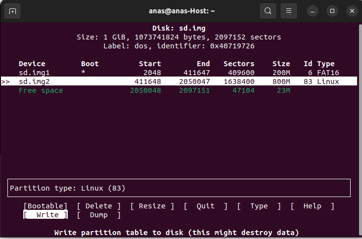
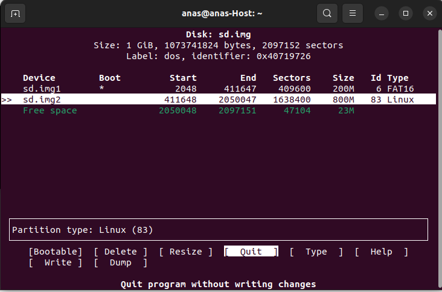

[TOC]

# How to create SD image in Linux (Virtual SD)	             

## 1. Task Definition 

Emulate SD card instead of buying the physical hardware by occupy space on your hard disk.

Keep in mind that the virtual SD card image file is just a file on your hard disk, and it does not represent a physical partition or consume a specific part of your hard disk like a traditional partition would. If you want to free up space, you can simply delete the virtual SD card image file.

## 2. Steps of creating virtual SD card

#### 2.1. Create a file called "sd.img" has a size of 1 GB (for example) filled by zeros.

- Open the Linux terminal in your computer and write this command:

```
dd if=/dev/zero of=sd.img bs=1M count=1024
```

> Let's explain the command : 
>
> - ***dd*** : which stands for ***disk/data duplicator***, is a command-line utility used for copying raw data between storage  devices and performing byte-level manipulation tasks, such as creating  disk images. Unlike *[cp](https://www.gnu.org/software/coreutils/manual/html_node/cp-invocation.html#cp-invocation)*, `dd` is not designed for copying individual files but used for reading from and writing to block devices, such as physical hard drives.
>
> - ***if** : stand for **Input File***, in this case, `/dev/zero` is a special file in Linux that provides an endless stream of null bytes when read. 
>
> - ***of*** : stand for ***Output File***, in this case the output file name is`sd.img`.
>
> - ***bs*** : stand for ***block size***, it is a parameter specify the size of the data blocks that are read from the input file (`if`) or written to the output file (`of`) during each iteration of the command.
>
>    Larger block sizes generally result in faster transfers, but the optimal size can depend on the characteristics of the storage devices. In this case ***1 Megabyte*** of date will transfer at a time.
>
> - ***count*** :  this sets the number of blocks to copy. In this example, it's set to ***1024***, so `dd` will copy ***1024 blocks*** of 1 megabyte each, resulting in a ***1 Gigabyte file***.


#### 2.2. Configure the Partitions Table of the Virtual SD card

- The required configuration parameters (in my case) to create partitions in virtual SD card : 

  - Size of sd.img file : 1GB
  - Virtual SD card divided into two partitions: ***FAT partition of 200 mb*** and ***EXT4 partition of 800 mb.***
  - The name of the partitions are: first partition ***boot*** and  second partition ***rootfs*** .

  | Partition Size | Partition Name | Partition Format | Bootable (boot partition) |
  | -------------- | -------------- | ---------------- | ------------------------- |
  | 200 MB         | boot           | *FAT 16*         | ***Yes***                 |
  | 800 MB         | rootfs         | *Linux* (Ext4)   | ***No***                  |

  

- Open the Linux terminal in your computer and run this command:

```
cfdisk sd.img
```

> -  ***cfdisk*** : it is command-line utility for managing disk partitions using a curses-based user interface. It provides an interactive way to view, create, delete, and modify disk partitions on a given storage device or disk image.
>
> - `sd.img`: This is the argument passed to `cfdisk`. It specifies the disk image file on which you want to perform partitioning. In this case, the disk image file named `sd.img`.


- User interface window will open :

  

- Select **dos**  by keyboard **arrows** and press ***Enter*** , then another configuration window will open :

   

- Select ***New*** to create new partition and press ***Enter*** , then select the *partition size*  and press ***Enter***.

##### 2.2.1.  Create the ***boot*** partition 

- Select the Size of boot partition (200 M) and press ***Enter***:

 


- Then select the type of boot partition (it should be ***primary*** type to make it bootable partition) , usually the primary partition holds the operating system.

  

  

- Make sure you select ***Bootable*** option for this partition (an Asterisk * will appear in **Boot** option) :

  

- Then Press on **Type** option to select file system type for boot partition ( ***FAT16*** )  :

  

- Search for **FAT16** file system type and press **Enter** :

  

- Save the configuration of ***boot partition*** by select **Write** option as bellow :

  

  - There is a question will appear *" Are you sure you want to write the partition table to disk"* , replay by writing ***"Yes"*** and press **Enter** .

    


- Congratulations ! , now you created a new partition has a size of 200Mb

  

- Press ***Quit*** option to exist and create a new partition.

​			

##### 2.2.2.  Create the ***rootfs*** (root file system) partition 

- Re-do the same steps above but there are some different parameters: 

- Select the partition size 800M.

  

- Then select the type of **rootfs** partition (should be extentend) and press **Enter** :

​	

- Then Press on **Type** option to select file system type for rootfs partition:

   

- Select Linux file system type (Ext4)

  

- Then save the partition configuration by press on **Write option** and then **Quite** :






#### 2.3. Emulate the sd.img as a Storage Device (SD card)

Till now we have the **sd.img**  as a regular file but we want to make ***sd.img*** as a storage device such as  SD card. we can do that by using the  ***loop device driver*** .

##### 2.3.1. Loop Device Driver

The loop driver in Linux is a kernel module that allows a file to be  mapped as a block device.                     The loop driver allows us to emulate block devices using regular files. This is  useful for testing and development when you want  to simulate the behavior of a physical storage device (such as an SD  card, USB drive, or hard disk) without having the physical hardware.


- Run the command bellow to do that :

  ```
  sudo losetup -f --show --partscan sd.img
  ```

  > - ***sudo***            : run the command with superuser privileges.
  > - ***losetup***       : the loop device setup command.
  > - ***f   flag***         : ***find*** the first available loop device.
  > - **show flag ** : display the name of the loop device that is associated.
  > - ***partscan***    : scan the image for partitions. This option is useful when the image  contain multiple partition, and you want the loop device to be associated with all of them.
  > - ***sd.img***        : The name of the file (in this case, `sd.img`) that you want to attach as a block device using a loop device.


- You can show the loop which associated with your virtual SD card by run bellow commands : 

```
#replace loopX by your device loop
losetup -a | grep <loopX>
```

```
lsblk | grep <loopX>
```


- We should assign the path of device loop which associated with virtual SD card (block device) to simplicity and re-usability in the next steps:

  ```
  export DISK=/dev/loop<x>
  ```

  

##### 2.3.2. Partitions Table Formating

We should format the  ***boot***  partition to be  ***FAT16***  :

```
sudo mkfs.vfat -F 16 -n boot ${DISK}p1
```

> - `sudo`: Run the command with superuser privileges.
> - `mkfs.vfat`: This command creates a FAT filesystem on the specified device.
> - `-F 16`: Specifies the FAT type (FAT16 in this case).
> - `-n boot`: Sets the volume label to "boot"
> - `${DISK}p1`: Represents the first partition on the block device, using the variable `DISK` that you've set.


And the  ***rootfs*** to be ***Ext4*** type:

```
sudo mkfs.ext4 -L rootfs ${DISK}p2
```

> - `sudo`: Run the command with superuser privileges.
> - `mkfs.ext4`: This command creates an ext4 filesystem on the specified device.
> - `-L rootfs`: Sets the volume label to "rootfs" .
> - `${DISK}p2`: Represents the second partition on the block device, using the variable `DISK` that you've set.


- To make sure that the partitions formating done correctly, run this command :

  ```
  lsblk -o NAME,LABEL,FSTYPE ${DISK}
  ```

  > - **`lsblk`**: This command is used to list information about block devices, including disks and partitions.
  > - **`-o NAME,LABEL,FSTYPE`**: This part specifies the columns to be displayed in the output. Here's what each column means:
  >   - `NAME`: The name of the block device or partition.
  >   - `LABEL`: The volume label assigned to the filesystem (if available).
  >   - `FSTYPE`: The filesystem type of the partition.
  > - **`${DISK}`**: This is a variable that represents the block device path. 


Congratulations ! , We created a Virtual SD card has two partitions first, boot partition and second rootfs partition. 


## 3. References 

- https://github.com/FadyKhalil/EmbeddedLinux/tree/main/3-Uboot
- https://dzone.com/articles/loop-device-in-linux
- https://www.easeus.com/knowledge-center/primary-vs-extended-partition.html
